# Regex & Python API Notes

Sep 23, 2026

## 1. Regex Basics

**Anchors** — pin position in the string

| Symbol | Meaning         |
| ------ | --------------- |
| `^`  | start of string |
| `$`  | end of string   |
| `\b` | word boundary   |

Always wrap patterns in `^...$` unless a substring match is intended.

**Character classes** — match one character from a set

| Symbol              | Meaning                      |
| ------------------- | ---------------------------- |
| `[abc]`           | a, b, or c                   |
| `[^abc]`          | anything except a, b, c      |
| `[a-z]`           | any lowercase letter         |
| `[0-9]` or `\d` | any digit                    |
| `.`               | any character except newline |
| `\s`              | whitespace                   |
| `\w`              | word char                    |

**Quantifiers** — how many times (both bounds in `{n,m}` are inclusive)

| Symbol    | Meaning                    |
| --------- | -------------------------- |
| `*`     | 0 or more                  |
| `+`     | 1 or more                  |
| `?`     | 0 or 1                     |
| `{n}`   | exactly n                  |
| `{n,}`  | n or more                  |
| `{n,m}` | between n and m, inclusive |

Quantifiers can't be stacked directly — `+*` is invalid syntax.

**Groups**

| Symbol            | Meaning                                                                    |
| ----------------- | -------------------------------------------------------------------------- |
| `(...)`         | capturing group — saves the match, retrievable later                      |
| `(?:...)`       | non-capturing group — groups for structure/quantifier only, nothing saved |
| `(?P<name>...)` | named capturing group                                                      |
| `\|`             | OR, e.g.`(cat\|dog)`                                                      |

`(?:...)` behaves identically to `(...)` for matching — the only difference is it isn't numbered or retrievable via `.group()`. Use it whenever grouping is only for applying a quantifier to a whole chunk, e.g. `(?:ab)+`, with no need to extract that submatch later.

**Retrieving captured groups in Python**

```python
import re
m = re.match(r'(\d+)-(\d+)', '123-456')
m.group(1)   # '123'  first capturing group
m.group(2)   # '456'  second capturing group
m.group(0)   # '123-456'  the WHOLE match, always exists
```

Groups are numbered by the position of their opening parenthesis, left to right, including nested ones. `(?:...)` groups are skipped entirely in this numbering — they don't consume a number slot:

```python
m = re.match(r'(?:a)(b)', 'ab')
m.group(1)  # 'b' — the (?:a) wasn't numbered, so (b) is still group 1
```

Named groups `(?P<year>...)` are retrieved with `.group('year')` — also still accessible by number. Useful when a pattern has many groups and counting parens gets error-prone.

## 2. Common Recipes

**At least N occurrences of X**

```
(?:[^X]*X){N,}
```

`(?:[^X]*X)` = some non-X chars then one X = one occurrence consumed. Repeat it `{N,}` times to guarantee at least N.

Example, at least two zeros: `(?:[^0]*0){2,}[^0]*$`

**Exactly N occurrences of X**

```
^[^X]*(?:X[^X]*){N}$
```

Locks the count exactly by not allowing extra X's after the Nth.

**Even number of X (including possibly 0)**

```
^(?:[^X]*X[^X]*X)*[^X]*$
```

Each `(?:...X...X...)` group consumes exactly 2 X's. `*` (zero or more) allows 0, 2, 4, 6...

**Even number of X, at least 2**

```
^[^X]*(?:X[^X]*X[^X]*)+$
```

Same pairing idea, but `+` forces at least one pair, i.e. at least 2 X's. This is the pattern behind `^1(?:[^0]*0[^0]*0)+[^0]*$` — starts with 1, one-or-more pairs of 0's (even count, ≥2).

**Odd number of X**

```
^[^X]*X(?:[^X]*X[^X]*X)*$
```

Consume one X first (making the base count odd), then any number of pairs on top (pairs preserve oddness).

**No two consecutive X's (no XX substring)**

```
^(?!.*XX).*$
```

Negative lookahead: at no point does XX appear ahead.

**Starts with X and ends with Y**

```
^X.*Y$
```

**Length constraints**

`^.{K}$` exactly K chars · `^.{K,}$` at least K chars · `^.{K1,K2}$` length between K1 and K2

**Repeated block pattern (string is some block repeated twice)**

```
^(.+)\1$
```

`\1` is a backreference to capture group 1 — matches whatever group 1 matched, again.

## 3. Gotchas

**Use `[^X]*` as filler when counting X, never `.*`**

`.*` is greedy and can swallow extra X's, breaking exact/even/odd counting since the regex engine could hide extra X's inside it. `[^X]*` guarantees zero X's in the filler, so every X is explicitly accounted for by the pattern.

Bad: `^1(?:.*0.*0)+.*$` — `.*` could swallow extra 0's Good: `^1(?:[^0]*0[^0]*0)+[^0]*$` — every 0 is explicit

**Never chain multiple `^...$` blocks**

`^` and `$` each only ever mark ONE true start and ONE true end of the string (outside multiline mode). Writing `^...$^...$` asks the engine to be at the end and the start at once — a contradiction that never matches.

To combine several independent conditions on the same string, stack zero-width lookaheads before the real matching pattern instead:

```
^(?=condition1)(?=condition2)(?=condition3)actual_pattern$
```

Each `(?=...)` checks its condition from position 0 without consuming characters, then the real pattern runs and consumes the string down to `$`.

Example — starts with 1 AND at least two 0's AND length ≥ 5:

```
^(?=1)(?=.*0.*0)(?=.{5,}$)1.*$
```

## 4. Making API Calls in Python

Most REST APIs are called with the `requests` library.

**Basic GET request**

```python
import requests

response = requests.get("https://api.example.com/users")
print(response.status_code)   # 200, 404, 500, etc.
print(response.text)          # raw response body as a string
```

**GET with query params and headers**

```python
headers = {"Authorization": "Bearer YOUR_TOKEN"}
params = {"page": 1, "limit": 20}

response = requests.get("https://api.example.com/users", headers=headers, params=params)
```

**POST request with a JSON body**

```python
payload = {"name": "Alice", "role": "engineer"}

response = requests.post("https://api.example.com/users", json=payload, headers=headers)
```

Using `json=payload` automatically serializes the dict to JSON and sets the `Content-Type: application/json` header — no need to call `json.dumps()` manually.

**Retrieving info from the response**

```python
response = requests.get("https://api.example.com/users/1")

response.status_code   # int, e.g. 200
response.headers       # dict-like of response headers
response.text          # body as a raw string
response.content       # body as raw bytes
response.json()        # body parsed into a Python dict/list, if it's valid JSON
```

**Always check the status before trusting the body**

```python
response = requests.get(url)
if response.status_code == 200:
    data = response.json()
else:
    print(f"Request failed: {response.status_code} {response.text}")

# or raise an exception on any 4xx/5xx status
response.raise_for_status()
```

**Error handling around network issues**

```python
try:
    response = requests.get(url, timeout=5)
    response.raise_for_status()
except requests.exceptions.Timeout:
    print("Request timed out")
except requests.exceptions.RequestException as e:
    print(f"Request failed: {e}")
```

## 5. Parsing JSON and Inspecting Dicts

### Full flow: `requests.get(url)` to `json.loads(...)`

**Put `response.text` inside `json.loads()`, not the `Response` object itself.**

```python
import json
import requests

url = "https://api.example.com/users/1"  # illustrative URL; replace with a real endpoint

response = requests.get(url, timeout=(3, 10))
# response is a requests.Response object: status, headers and response body.

response.raise_for_status()  # raise HTTPError for a 4xx/5xx response

raw = response.text
# Example value: '{"name": "Alice", "age": 30, "active": true}'
# type(raw) is str: text that follows JSON syntax.

data = json.loads(raw)
# Example value: {'name': 'Alice', 'age': 30, 'active': True}
# type(data) is dict for this particular JSON object.

print(data["name"])  # Alice
print(data["age"])   # 30
```

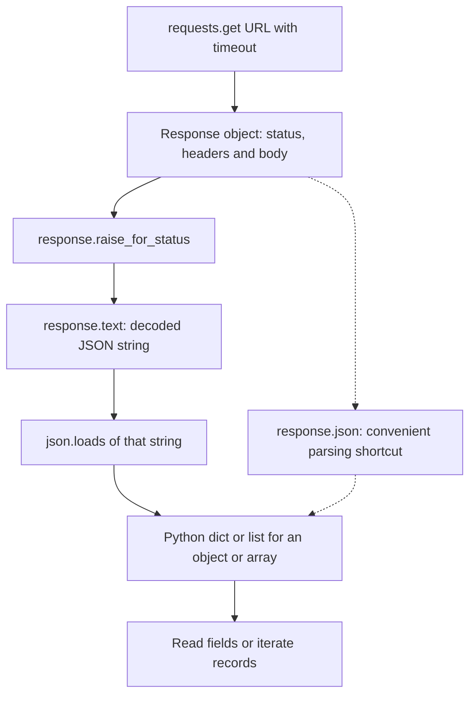

The diagram shows the successful object/array case. Network failure can prevent a response; an HTTP error can stop at the status check; an empty/HTML/malformed body can fail JSON parsing. A JSON scalar can also parse into a Python string, number, boolean or `None`.

**Usual shorter version:**

```python
response = requests.get(url, timeout=(3, 10))
response.raise_for_status()
data = response.json()  # normally use this instead of json.loads(response.text)
```

`.json()` parses the existing response body; it does **not** send another network request. You do not need to run both parsing versions. `Response.json()` also handles response encoding details, so prefer it for ordinary JSON APIs.

| Expression                    | Result / purpose                                      |
| ----------------------------- | ----------------------------------------------------- |
| `response`                  | Response object, not the parsed business data         |
| `response.status_code`      | Integer HTTP status, such as 200                      |
| `response.headers`          | Response headers, including any declared content type |
| `response.content`          | Body as bytes                                         |
| `response.text`             | Body decoded as a Python string                       |
| `json.loads(response.text)` | Parse JSON text into Python data                      |
| `response.json()`           | Convenient response-body JSON parsing method          |
| `json.dumps(data)`          | Opposite direction: Python data to a JSON string      |

**`loads` = load from a string; `dumps` = dump to a string.** `json.load(file_object)` reads from a file-like object instead.

```python
# Wrong:
# data = json.loads(response)        # Response is not JSON text
# data = json.loads(response.json()) # already parsed; do not parse twice
# data = json.dumps(response.text)   # serializes the text; does not parse it

# JSON array response:
# [{"id": 1}, {"id": 2}]
# data is a list, so access data[0]["id"], not data["id"].

# Nested object response:
# {"users": [{"name": "Alice"}], "next_page": null}
# data["users"][0]["name"] gives "Alice".
# data["next_page"] is None.
```

**Handling the three separate failure stages:**

```python
try:
    response = requests.get(url, timeout=(3, 10))
    response.raise_for_status()
except requests.exceptions.HTTPError:
    print(f"HTTP failure: {response.status_code}")
except requests.exceptions.RequestException:
    print("Network/request failed; there may be no HTTP response.")
else:
    try:
        data = json.loads(response.text)
    except json.JSONDecodeError:
        print("The body is empty or is not valid JSON.")
    else:
        if isinstance(data, dict) and "name" in data:
            print(data["name"])
        else:
            print("Valid JSON, but not the expected user-object shape.")
```

For this example, the API is expected to return a user object. Handle an intentionally empty 204 according to its contract instead of parsing it. A server can return HTML with status 200, so success status does not guarantee JSON. A `Content-Type` header is useful evidence, not proof that the body is valid. Avoid printing full response bodies indiscriminately; they may contain private information.

References: [Requests response handling](https://requests.readthedocs.io/en/latest/user/quickstart/), [Python JSON conversion](https://docs.python.org/3.13/library/json.html). `json.loads` also accepts JSON bytes/bytearray; the string route above makes each transformation explicit for learning.

**Parsing a JSON string manually**

```python
import json

raw = '{"name": "Alice", "age": 30, "skills": ["python", "sql"]}'
data = json.loads(raw)   # string -> Python dict

print(type(data))        # <class 'dict'>
print(data["name"])      # 'Alice'
```

`response.json()` from the `requests` library does this `json.loads()` step for you automatically.

**Going the other way — dict to JSON string**

**Inspecting a dict's shape**

```python
data = {"name": "Alice", "age": 30, "skills": ["python", "sql"], "address": {"city": "SF"}}

data.keys()      # dict_keys(['name', 'age', 'skills', 'address'])
data.values()    # dict_values(['Alice', 30, [...], {...}])
data.items()     # dict_items([('name', 'Alice'), ('age', 30), ...])

len(data)        # number of top-level keys
type(data)       # <class 'dict'>
```

**Safely accessing keys that might be missing**

```python
data.get("email")             # None if 'email' doesn't exist, no error
data.get("email", "unknown")  # 'unknown' as a default instead of None

# vs. direct indexing, which raises KeyError if missing
data["email"]   # KeyError: 'email'
```

**Walking nested structures**

```python
data["address"]["city"]        # 'SF' — chain keys for nested dicts
data["skills"][0]              # 'python' — index into a nested list

# safe nested access
city = data.get("address", {}).get("city")
```

**Pretty-printing for exploration**

```python
import json
print(json.dumps(data, indent=2))   # readable, nested view of the whole structure

from pprint import pprint
pprint(data)                        # alternative, no JSON serialization needed
```

**Checking key existence and iterating**

```python
if "email" in data:
    print(data["email"])

for key, value in data.items():
    print(key, "->", value)
```

```python
d = {"name": "Alice", "age": 30}
json_str = json.dumps(d)             # compact string
pretty = json.dumps(d, indent=2)     # pretty-printed, readable string
```

## 6. System Design: How to Answer Any Question

For supporting fundamentals, see sections **13 (HTTP/API status and requests)**, **14 (networking and browser flows)** and **15 (operating systems and concurrency)** below.

Added Sep 23, 2026. These are **proposed interview designs**, not descriptions of Google's, YouTube's, TikTok's or a trading firm's private production stack. All traffic numbers are practice assumptions. Diagrams are Mermaid: open this file in a Mermaid-capable Markdown viewer.

**Why add this?** Syntax/API notes do not prepare you to reason about scale, correctness or failure. **Benefit:** a repeatable method and diagrams you can draw and defend. **Limitation:** memorizing boxes is insufficient; change the assumptions and explain what breaks. **Alternatives:** a list of technology names lacks reasoning; external drawing tools are convenient but separate diagrams from the notes. These worked examples use editable diagrams beside their tradeoffs.

### The 45-minute interview structure

| Time       | Do this                                 | Say something like                                                                                 |
| ---------- | --------------------------------------- | -------------------------------------------------------------------------------------------------- |
| 0–5 min   | Clarify scope and users                 | "For YouTube, should I focus on upload/playback or recommendations? Is live streaming excluded?"   |
| 5–10 min  | Define constraints and estimate load    | "Assume one million daily viewers. What matters most: startup time, upload throughput or cost?"    |
| 10–15 min | Define API, data and invariants         | "Only authorized viewers may play private videos; only ready renditions are published."            |
| 15–25 min | Draw the main read and write paths      | "Video bytes go through object storage/CDN; metadata goes through the API."                        |
| 25–38 min | Deep-dive into the main bottleneck      | "Let's examine duplicate transcode jobs and recovery after a worker crash."                        |
| 38–45 min | Discuss failure, security and evolution | "Here is the smallest useful design, what fails at ten times traffic, and how I would measure it." |

**Functional requirement:** what users can do. **Non-functional requirement:** latency, availability, durability, privacy, cost and capacity. **Invariant:** something that must never be violated, such as filling an order for more than its remaining quantity.

An SLO is a measurable service objective: define the operation, percentile, threshold and window. "Fast" is not an SLO. A hypothetical search target could be "99% of successful search API responses under 300 ms over a day"; separately track errors so fast failures do not make performance look good.

### Estimates: write the units

```text
average requests/s = daily active users × actions/user/day ÷ 86,400
peak requests/s    = average requests/s × assumed peak factor
storage/day        = new objects/day × average object bytes
network bits/s     = concurrent streams × average stream bitrate
in-flight requests ≈ arrival rate × average time in system
```

The last relationship assumes a stable system; do not substitute p99 for the average. For 1,000 requests/s and 0.2 seconds average time in system, expect about 200 in-flight requests. That does not automatically mean 200 database connections.

Example: 10 million users × 10 searches/day = 100 million searches/day ≈ 1,157 requests/s average. A chosen 5× peak factor gives ≈ 5,787 requests/s. These are hypothetical numbers, not Google's traffic. Measure capacity per instance before translating QPS into a machine count.

### Components: what problem does each solve?

| Component            | Purpose                                                 | Cost / trap                                             |
| -------------------- | ------------------------------------------------------- | ------------------------------------------------------- |
| Load balancer        | Spread requests across healthy instances                | Does not resolve a shared database bottleneck           |
| SQL database         | Constraints, transactions, indexed structured queries   | Hot rows, joins and connections still need design       |
| Object storage       | Large immutable files, images, video and backups        | Not a replacement for transactional metadata queries    |
| CDN                  | Serve reusable bytes near viewers                       | Invalidation, private access and bandwidth costs        |
| Cache                | Avoid repeated expensive reads/computation              | Stale values, eviction and cache stampedes              |
| Queue                | Buffer work and let workers process later               | Duplicates, backlog, retries and poison jobs            |
| Replayable event log | Retain ordered events for multiple consumers and replay | Ordering is usually per partition; operational overhead |
| Search index         | Retrieve documents by text efficiently                  | Derived data can lag behind authoritative records       |
| Read replica         | Add read capacity and failover options                  | Replication lag; does not multiply write capacity       |
| Sharding             | Divide data/write load between machines                 | Cross-shard queries, transactions and rebalancing       |

**Replication** copies the same data. **Sharding** splits data. **Async I/O** overlaps waits. **A background job** continues independently of a request. **Parallelism** runs work simultaneously. These terms are not interchangeable.

### Questions you should ask yourself at every box

- What is its input/output and source of truth?
- How is data partitioned? What happens to a very popular key?
- Can I retry safely? Where is the idempotency key stored, and for how long?
- What happens if a dependency times out after actually completing the operation?
- Which reads may be stale? Which writes require a transaction or an ordered owner?
- What is the overload policy: reject, queue, shed optional work or degrade results?
- What metric tells me this box is failing?

**CAP precision:** during a network partition, a distributed operation cannot guarantee both linearizable consistency and a successful response from every non-failing node. It is not a permanent "pick any two" shopping list. Choose per operation: a feed can tolerate stale recommendations; two partitioned matching engines must not both accept orders for the same book.

## 7. Design a Google-like Search Engine

Apply the [product, security and efficiency checklist in section 12](#12-design-beyond-the-backend-ux-security-storage-and-efficiency) to this and every following design. It explains the less obvious requirements that are easy to miss when drawing server boxes.

**Opening answer:** "I would separate crawling and indexing from query serving. Crawlers build a searchable representation in the background; a query searches replicated index shards and merges ranked candidates. We do not fetch the whole web for every search."

### Scope, API and data

Start with public text pages, keyword search and ranked results. Exclude ads, image search and generated answers unless asked. Clarify corpus size, supported languages, acceptable freshness and latency. Proposed example: 100 million documents and the 100 million searches/day estimate above.

```text
GET /search?q=repair+battery&cursor=...&limit=10
 -> {results: [{document_id, title, url, snippet}], next_cursor}

Document(document_id, canonical_url, content_hash, fetched_at, status, text_ref)
Posting(term -> sorted document IDs, frequencies, optional word positions)
CrawlTask(url, host, next_fetch_at, attempts)
```

**Inverted index:** maps words to documents, rather than opening every document to check for words.

```text
"repair"  -> [doc2, doc7, doc9]
"battery" -> [doc1, doc7, doc9]
AND query candidates -> [doc7, doc9]
```

Positions support phrase queries; compressed postings reduce storage and I/O. An index narrows candidates, but a very common word can still have a huge posting list. Don't claim all searches are O(1).

### Draw it: ingestion and serving are different paths

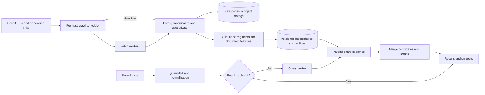

**Read path:** normalize query → check context-aware cache → search one healthy replica per relevant shard → retrieve candidates → merge/rerank → build snippets. Cache keys include relevant language, filters and index/model version; personalized results cannot share an unrestricted global key.

**Write path:** discover URL → enforce per-host crawl limits and applicable robots rules → fetch with size/time limits → extract text/links → canonicalize/deduplicate → build index → publish a new searchable generation. Treat fetched content as untrusted; defend a crawler service from internal-network fetches and malicious payloads.

### Scaling and decisions

| Decision                                                        | Why                                                             | Alternative / tradeoff                                                                                |
| --------------------------------------------------------------- | --------------------------------------------------------------- | ----------------------------------------------------------------------------------------------------- |
| Document-partitioned index                                      | Each shard handles all query terms for its document subset      | Queries fan out; term partitioning can cause hot common terms and expensive distributed intersections |
| Lexical retrieval, optional semantic candidates, then reranking | Cheap broad retrieval before expensive scoring                  | Vector-only search can miss exact identifiers; lexical-only retrieval can miss semantic intent        |
| Incremental indexing plus background segment merges             | Updates need not rebuild the entire corpus                      | Freshness, merge I/O and serving resources compete                                                    |
| Replicas and query deadlines                                    | Survive failures and bound tail latency                         | Partial results reduce recall; specify when to fail instead                                           |
| Cache popular queries with request coalescing                   | One backend computation can serve simultaneous identical misses | Stale results; personalization lowers reuse                                                           |

For a prototype, use PostgreSQL for crawl metadata, object storage for raw pages, and a Lucene-based search service such as OpenSearch/Elasticsearch for the index. SQL `LIKE '%word%'` is easy for a tiny corpus but does not provide the same retrieval/ranking capabilities. Don't build a custom web-scale index on day one. Google's public documentation separates crawling, indexing and serving; the shard layout above is our proposed design. [Google search stages](https://developers.google.com/search/docs/fundamentals/how-search-works). Search-index refresh visibility is distinct from durable storage commits. [Elastic refresh explanation](https://www.elastic.co/docs/manage-data/data-store/near-real-time-search).

**Sizing exercise:** 100 million pages × assumed 20 KB extracted text = 2 TB of text, before raw HTML, postings, features, replicas and headroom. Measure index expansion/compression on a representative sample; do not assume the final index is also exactly 2 TB.

### Interview follow-ups

- **A shard is slow?** Use deadlines and replicas; optional delayed hedging increases load and must be bounded. Report partial results or fail according to the product contract.
- **A page is deleted?** Stop serving it via a tombstone/filter, invalidate affected caches, then remove it from subsequent index generations and retained storage according to policy.
- **How do you keep news fresh?** Prioritize recrawls by change frequency and importance within per-host budgets. Freshness has a compute/network cost.
- **How do you rank?** Start with lexical relevance such as BM25 plus quality/freshness signals; evaluate offline relevance and online outcomes. A sophisticated model cannot recover a relevant document never retrieved.
- **What do you monitor?** Query p95/p99, timeout/error rate, crawl backlog, index age, cache hit rate and relevance metrics. Speed alone does not make search good.

## 8. Design YouTube-like Upload and Playback

**Opening answer:** "I would separate the control plane—ownership, metadata and processing state—from the media bytes. Upload directly to object storage, transcode asynchronously, and serve adaptive-bitrate segments through a CDN."

### Scope, APIs and states

Assume recorded videos, resumable uploads, public/private playback and multiple qualities. Leave live streaming, recommendations and copyright matching as explicit extensions.

```text
POST /videos/upload-sessions   {filename, size, content_type, idempotency_key}
 -> {video_id, multipart_upload_info}
POST /videos/{id}/complete     {uploaded_parts, checksum}
GET  /videos/{id}              -> metadata and processing state
POST /videos/{id}/playback     -> authorized manifest URL or denial

Video(id, owner_id, title, visibility, state, source_key, generation)
Rendition(video_id, generation, codec, resolution, bitrate, manifest_key)
Job(video_id, generation, stage, status, attempt)
```

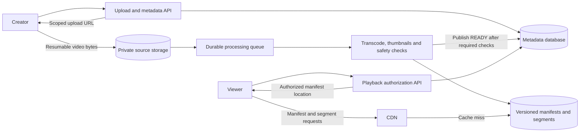

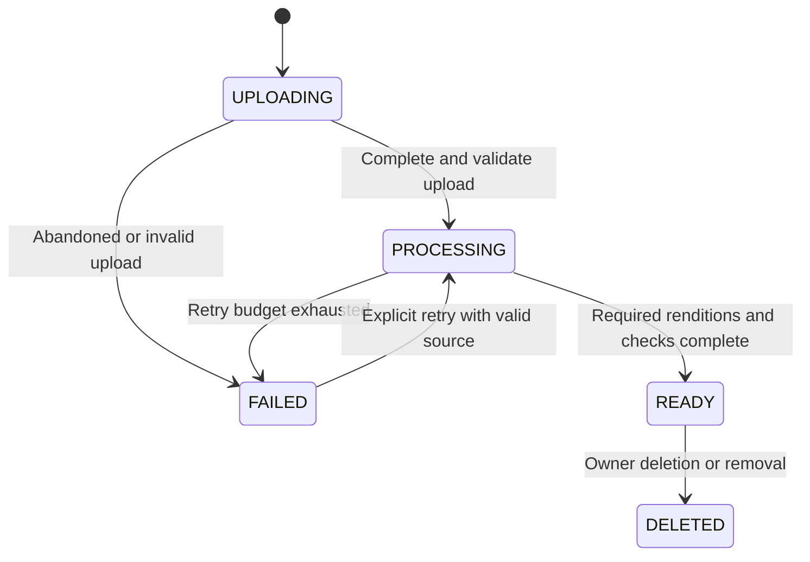

The upload-completion API must verify the object/parts exist and match expected ownership, size and checksum; a client saying "complete" is not sufficient. Object notifications can duplicate, so queue consumers must tolerate repeat messages. A transactional outbox can reliably connect committed metadata changes to job publication; otherwise a crash between database commit and queue send can strand a video.

**Adaptive bitrate:** store multiple encoded renditions and a manifest listing them. The player selects segment quality according to bandwidth and buffer health. It fetches segments instead of downloading an entire large source file before starting. AWS documents a concrete object-storage → MediaConvert → packaged output → CloudFront workflow; the APIs and failure contract here are an interview proposal. [AWS video-on-demand architecture](https://docs.aws.amazon.com/solutions/video-on-demand-on-aws/).

### Sizing exercise and tradeoffs

Assume 100,000 uploads/day at 100 MB each: **10 TB/day of original uploads**. If the combined outputs take twice the original size, that is another 20 TB/day—30 TB/day total before replication and retention. Separately, 100,000 simultaneous viewers at 3 Mb/s require **300 Gb/s** of delivered video bandwidth. Bytes and bits differ by 8×. These estimates explain why bandwidth, retention and encoding dominate this design.

| Choice                                    | Benefit                                                                         | Cost / alternative                                                                 |
| ----------------------------------------- | ------------------------------------------------------------------------------- | ---------------------------------------------------------------------------------- |
| Direct multipart object upload            | API instances avoid carrying large media bodies; interrupted uploads can resume | Expiring upload permissions and abandoned parts need cleanup                       |
| Async transcode workers                   | Retries and scaling independent of web requests                                 | Videos remain processing; queue age matters more than HTTP latency                 |
| Managed transcoder or FFmpeg worker fleet | Managed service reduces operations; own workers give control                    | Managed cost/vendor dependence versus codec tuning, sandboxing and fleet ownership |
| CDN delivery                              | Cache popular segments close to viewers                                         | Cache misses, egress cost and content revocation                                   |
| SQL metadata plus object media            | Transactions for ownership/state; efficient large-file storage                  | Cross-system workflow requires idempotency and reconciliation                      |

**Worker crash:** write outputs under `(video_id, generation, rendition)`; retries may replace the same deterministic output or publish a new generation. Atomically mark a generation ready only when required artifacts exist. Never expose half-written manifests.

**Private video:** authorize the viewer before issuing short-lived playback access; protect both manifest and segments and block public origin bypass. A CDN cache must not accidentally make private bytes public. On deletion, deny new grants, invalidate/remove outputs and account for already-issued access expiry.

**Viral video:** CDN absorbs repeated bytes; coalesce origin misses, prewarm only when justified, and cache metadata. Adding API pods does not fix a saturated media origin.

**Monitor:** upload completion rate, oldest job age, transcode failures, playback startup p95/p99, rebuffer ratio, CDN hit rate and cost per delivered viewing hour. A fast metadata API can coexist with terrible playback.

## 9. Design a TikTok-like Infinite Scroll Feed

**Opening answer:** "The challenge combines recommendation freshness with smooth playback. I would separate candidate retrieval, ranking and eligibility checks, serve a stable session cursor, and prefetch a bounded amount of upcoming media."

### Scope and data

Assume short recorded videos, personalized discovery, skip/like/watch events and moderation. Reuse the upload/transcode/CDN design above. Clarify whether the interviewer means a personalized 'For You' feed or a following-only timeline; they are different retrieval problems.

```text
GET  /feed?cursor=...&limit=10
 -> {feed_session_id, items: [{video_id, playback_ref}], next_cursor}
POST /events
 {events: [{event_id, user_id, video_id, impression_id, type,
            watch_ms, event_time, feed_session_id}]}

FeedSession(id, user_id, ordered_candidate_ids, model_version, expires_at)
Interaction(event_id, user_id, video_id, impression_id, type, event_time)
VideoFeatures(video_id, language, categories, embedding, eligibility_version)
```

Identity comes from authentication, not an untrusted `user_id` field. Cap page size/event batch size and validate timestamps/durations. Track an impression ID so watches/skips can be associated with what was actually shown.

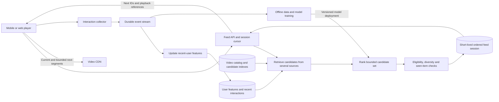

**Candidate retrieval:** combine followed creators, popular/local content, recent uploads and similarity candidates. Retrieve hundreds or thousands—not every video—for more expensive ranking. Two-stage candidate generation and ranking has a published YouTube precedent; this does not establish TikTok's private implementation. [YouTube recommendation paper](https://research.google/pubs/deep-neural-networks-for-youtube-recommendations/).

**Ranking:** predict useful outcomes under a latency budget. Balance relevant engagement with satisfaction, diversity and safety; pure watch-time maximization can reward repetitive or harmful content. Use exploration to learn about new content, and compare model versions through controlled experiments.

### Deep dive: pagination and scrolling

Offset pagination over continuously changing scores causes duplicates and skipped items: the item at position 11 may move between requests. For this design, create a short-lived ordered candidate session and return an **opaque, authenticated cursor** referencing session and position. Keep consumed IDs/recent history to reduce repetition. Refill the session when depleted; expire bounded state instead of keeping every session forever.

A frozen candidate order improves continuity but becomes stale. Recheck deletion, blocks, age/region restrictions and other eligibility at serving time. If a candidate is removed, skip it and fetch more. A stateless cursor is cheaper to store but harder to use with changing ranking and deduplication.

Prefetch the start of the next one or two videos, adapting to network/data-saving settings. Cancel unnecessary fetches after fast swipes; avoid eagerly downloading ten full videos. Virtualize the UI so only nearby items keep players/DOM nodes alive. Buffer limits and decoder reuse matter as much as API speed.

### Scaling and failure

Example: 10 million daily users × 200 impressions/day = 2 billion impressions/day ≈ **23,148 impressions/s average**. At 10 items per feed page, the rough API floor is 2,315 page requests/s, before unused prefetched items, retries and peaks. Multiple watch events per impression make event traffic larger still. Media delivery is a separate bandwidth calculation.

| Decision                                | Benefit                                                            | Tradeoff / alternative                                             |
| --------------------------------------- | ------------------------------------------------------------------ | ------------------------------------------------------------------ |
| Pull and rank discovery feed on request | Reflect recent interests; avoid copying every upload to every user | Ranking/feature latency; cache candidate pools and enforce budgets |
| Hybrid following feed                   | Precompute for ordinary fanout, pull celebrity posts when reading  | More merge logic; pure fanout-on-write explodes for huge audiences |
| Async interaction stream                | Playback doesn't wait for training/analytics                       | Eventual feature freshness; deduplication and out-of-order events  |
| Small online feature store/cache        | Fast feature access                                                | Missing/stale features require fallback values                     |
| Short-lived session snapshots           | Stable cursor and reduced repeat ranking                           | Memory, expiry and stale ordering                                  |

**Ranker unavailable:** return a safe eligible fallback pool matched by language/region; do not make playback wait indefinitely. **Event pipeline lag:** continue serving with older features and monitor lag. **Duplicate event:** deduplicate by event ID within a defined retention window; apply transactional/conditional updates for durable counters when exactness matters. Stream-processing guarantees do not automatically make arbitrary external side effects exactly once. [Kafka delivery semantics](https://kafka.apache.org/35/design/design/).

**Monitor:** feed p99, swipe-to-first-frame latency, buffering, repeated-item rate, recommendation quality, event lag, eligibility violations and experiment guardrails. Likes may tolerate briefly stale counts; a blocked creator or removed video needs a stronger serving check.

## 10. Trading Systems: Clarify Which Problem First

"HFT app" could mean three different systems. Ask which one before drawing a generic web stack.

| System                                | Main job                                                      | Dominant concern                                                     |
| ------------------------------------- | ------------------------------------------------------------- | -------------------------------------------------------------------- |
| Retail trading dashboard/broker API   | Display prices, accept user orders, show portfolio            | Authentication, durable order lifecycle and user-visible correctness |
| Exchange matching engine / order book | Decide which buy/sell orders trade                            | Deterministic sequencing, matching rules and recoverability          |
| HFT firm's execution system           | React to market data, manage risk and submit orders to venues | Predictable low latency, correct market state and bounded exposure   |

Here, **book** means a limit order book: outstanding buy/sell orders arranged by price and priority. A trader's local market-data book is a reconstruction of visible venue events; it is not the exchange's authoritative matching state and may omit hidden liquidity.

These are engineering interview exercises, not a trading strategy or a production-ready financial system.

### A. Design an exchange order book

**Opening answer:** "I would use one deterministic owner per instrument partition, sequence every command, and define durability before acknowledging acceptance. Parallelize independent partitions while preserving order within each book."

Assume one venue, limit orders, price-time priority and partial fills. Exclude auctions, hidden orders, complex order types and cross-instrument atomic trades initially. Real venues differ; confirm the rule instead of assuming every exchange matches identically. Nasdaq's OUCH overview describes price-time matching and resting unmatched orders. [Nasdaq OUCH](https://www.nasdaqtrader.com/Trader.aspx?id=ouch).

```text
NewOrder(client_order_id, account, symbol, side, price_ticks, quantity)
CancelOrder(client_request_id, original_order_id)
ExecutionReport(sequence, order_id, status, fill_quantity, remaining_quantity)

prices -> ordered price levels
price level -> FIFO linked queue of resting orders
order_id -> hash map entry pointing directly to its queue node
```

Use integer price ticks and integer quantity units, not floating-point prices. For a sparse price space, a balanced tree supports ordered levels. The hash map finds a cancellation target in expected O(1); unlinking is O(1) with direct node references, but removing an empty tree level can cost O(log P), where P is the number of price levels. An incoming order matching K resting orders must at least process those K fills. Dense bounded tick arrays offer different locality/memory tradeoffs; there is no universal O(1) book for every operation.

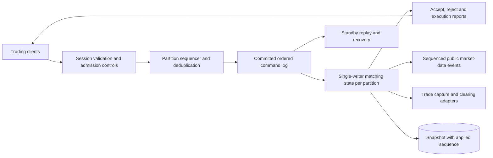

**Durability contract for this exercise:** acceptance/fill responses are sent only after the corresponding command is durably committed under the selected replication policy and applied. This adds storage/replication latency. A speculative response before persistence is a different loss guarantee; don't draw a slow audit log off to the side and claim acknowledged orders cannot be lost.

**Worked matching example — execution at resting price:**

```text
Asks, lowest price first:
100.00: A sells 4, then B sells 6
101.00: C sells 5

Incoming D: BUY 8 with limit 101.00
 -> fill A for 4 at 100.00
 -> fill B for 4 at 100.00
 -> D fully filled; B retains 2; C untouched
```

The limit is the worst acceptable price, not necessarily the execution price. If only 5 units can match, a day limit order may rest its remaining 3; an immediate-or-cancel order instead cancels the remainder. State the chosen order type.

**Cancel races with fill:** the sequencer determines the order. A cancel processed after the fill cannot undo it. Client send timestamps across machines do not establish authoritative ordering. **Retry after timeout:** reuse a scoped client request ID; identical duplicate commands return the recorded outcome, conflicting payloads are rejected. Timeout means unknown outcome, not proof the order was rejected.

**Recovery:** load a snapshot through sequence N, replay committed commands after N deterministically, reconstruct dedup state and reconcile outgoing reports by sequence. Consumers must handle replayed reports idempotently. Fence the old leader before takeover; two writers for one book can create inconsistent trades. Snapshot-only recovery loses events since the snapshot.

**Cross-book risk:** sharding books does not make account-wide limits atomic. A design might reserve bounded buying-power allocations per partition or use a coordinated reservation service before admission. Independent partitions reading the same stale balance can overspend it.

**Test:** no negative remaining quantities; total fill quantity never exceeds accepted quantity; FIFO at equal price; deterministic replay produces the same state hash; duplicate requests do not create duplicate orders; failover never allows two active owners. Benchmark p50/p99/p99.9 latency under bursts, not just average throughput.

### B. Design an HFT market-data and execution system

**Opening answer:** "I would separate a small latency-sensitive event path from research and operations. Reconstruct market state from sequenced feeds, run strategy logic, enforce pre-trade risk, and submit through venue gateways. Stop new risk when state is uncertain."

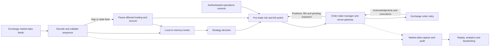

**Market-data gap:** track expected sequence per channel/session. On a gap, buffer within limits and request retransmission or rebuild from a snapshot plus subsequent deltas. Do not keep trading as though the book were complete. Nasdaq's MoldUDP64 specification provides sequence and retransmission mechanics; actual venue recovery protocols must be implemented as specified. [MoldUDP64](https://nasdaqtrader.com/content/technicalsupport/specifications/dataproducts/moldudp64.pdf).

**Risk before sending:** bound order size/notional, price deviation, outstanding orders, message rate and total exposure including pending orders. Update positions on executions, not submission. A requested cancel does not free exposure until cancellation is confirmed or reconciled. A kill switch blocks new orders and initiates cancellation, but cannot guarantee instantaneous removal of orders at a disconnected venue.

**Order lifecycle:** submitted → acknowledged → partially filled → filled, canceled or rejected, with timeout/unknown states requiring reconciliation. Late fills can arrive while a cancel is pending. Persist identifiers and recover outstanding state before resuming after a crash. Handle replayed execution messages without counting fills twice.

### Tools, latency and tradeoffs

| Choice                                            | Why it may fit                                             | What to watch / alternative                                                                                             |
| ------------------------------------------------- | ---------------------------------------------------------- | ----------------------------------------------------------------------------------------------------------------------- |
| C++ or Rust for a measured critical path          | Control allocations, memory layout and system integration  | More implementation complexity; optimized Java is also viable where its latency profile meets requirements              |
| Python for research; FastAPI for operational APIs | Productive analytics and human-facing controls             | Not the default choice for a strict microsecond event loop; async web endpoints do not eliminate runtime/network jitter |
| In-process state and bounded queues               | Avoid a network/database hop for every market event        | Backpressure, ownership and crash recovery become explicit responsibilities                                             |
| Single-writer stages                              | Reduce shared-state contention and simplify event ordering | One hot partition has a capacity ceiling; cross-partition coordination remains hard                                     |
| Colocation and tuned networking when required     | Reduce physical/network delay                              | Specialized hardware, expense and operational coupling; cloud VMs may suffice for slower strategies                     |
| Durable journal, snapshots and replay             | Reconstruct state and investigate outcomes                 | Persistence latency and storage policy must match the promised failure guarantee                                        |

Preallocated ring buffers can reduce allocation and handoff overhead; they are not magic and still require correct publication, memory visibility and backpressure. LMAX documents single-writer stages and its Disruptor pattern; its published benchmarks are not results for our design. [LMAX Disruptor guide](https://lmax-exchange.github.io/disruptor/user-guide/).

Measure the path as receive → decode → book update → decision → risk → send, plus venue/network latency separately. A hypothetical 100-microsecond internal p99 budget must be measured with the clock boundaries stated; it is not a claim about achievable end-to-end latency. Busy polling can reduce wake-up jitter but burns CPU. Pinning cores or kernel bypass should follow profiling, not appear as unexplained interview buzzwords.

**Failure policy:** reject or pause new risk when feeds, risk state or required durable capture are unhealthy. Optional telemetry may drop under a defined policy; accepted orders, required audit records and execution reports cannot be silently dropped. A general event bus can serve analytics; putting one between every critical stage adds hops and tail latency.

### C. How a retail trading app differs


Here FastAPI and PostgreSQL can be sensible starting tools. An outbox records intent atomically with a database update; its dispatcher can retry delivery using stable IDs and downstream duplicate handling. An HTTP 202 can mean "durably queued", not "accepted by the exchange". Portfolio reads may lag, but order acceptance and risk reservations require explicit correctness. This system prioritizes a durable lifecycle over shaving microseconds from a matching loop.

## 11. Cross-System Interview Drills

### One comparison to remember

| Design           | Dominant scaling axis                      | Tolerable staleness                         | Core correctness requirement                                       |
| ---------------- | ------------------------------------------ | ------------------------------------------- | ------------------------------------------------------------------ |
| Search           | Index size, fanout and ranking CPU         | Some crawl/index lag                        | Respect eligibility/removal rules; isolate private results         |
| Video            | Storage, encoding and delivery bandwidth   | View counts can lag                         | Never expose unauthorized or incomplete media                      |
| Short-video feed | Ranking, event volume and playback latency | Features can be slightly stale              | Enforce eligibility, handle cursor continuity and duplicate events |
| Order book       | Ordered event rate and tail latency        | Not for authoritative order state           | One ordered history; no overfills or duplicate orders              |
| HFT execution    | Feed bursts, jitter and venue connectivity | Stale market state can invalidate decisions | Bound risk and reconcile uncertain order state                     |

### Common follow-ups with an answer direction

1. **"Scale this by 10×."** Identify the saturated resource first. Search may need index shards/replicas; video needs delivery/encoding capacity; one hot order book cannot be arbitrarily split without preserving order.
2. **"Why not microservices immediately?"** Start with modular boundaries. Split when independent scaling, failure isolation or team ownership justifies deployment/network complexity.
3. **"Why SQL versus NoSQL?"** Begin with access patterns and invariants. Transactions/relationships favor SQL; predictable key access at huge scale may favor a partitioned key-value store. Both require indexing and hot-key design.
4. **"What if the cache disappears?"** A cache should normally be rebuildable. Protect the source with admission limits, staggered expiry and request coalescing; don't unleash unlimited misses.
5. **"What if the queue grows forever?"** Compare arrival rate with processing capacity; monitor oldest-message age, bound retries, isolate poison messages, scale workers or reject work. A queue delays overload; it does not remove it.
6. **"How do you achieve exactly once?"** Define the boundary. Use idempotency, uniqueness and atomic commits for state effects; do not promise a network can never redeliver.
7. **"How do you deploy without downtime?"** Compatible API/event versions, expand-then-contract schema changes, staged rollout, health checks and rollback. Stateful leaders need fencing and state transfer, not just a rolling restart.
8. **"How do you handle regional failure?"** State RPO (acceptable data loss) and RTO (recovery time). Replication lag, leader ownership and failover policy matter more than drawing two regions.
9. **"How do you test it?"** Functional invariants, replay/retry tests, representative load, dependency failures and recovery drills. Include cold caches, hot keys and long-tail request sizes.
10. **"What would you cut for an MVP?"** One region, managed storage, simple ranking and a few reliable workflows. Preserve authorization, data integrity and recovery; postpone unnecessary distributed complexity.

### Draw these next as practice questions

| Question                 | Start with                                             | Deep dive                                                          |
| ------------------------ | ------------------------------------------------------ | ------------------------------------------------------------------ |
| URL shortener            | Create mapping; redirect by short key                  | Collision handling, cache, abuse and expiry                        |
| Chat application         | Send/store messages; deliver to connected clients      | Per-conversation ordering, offline delivery and deduplication      |
| Ticket booking           | Search events; reserve seats; pay                      | Hold expiry, preventing overselling and payment reconciliation     |
| Distributed rate limiter | Identity/key → token bucket decision                  | Atomic updates, hot keys and fail-open versus fail-closed behavior |
| Notification system      | Durable intent → channel workers                      | Preferences, retries and duplicate sends                           |
| Payment ledger           | Idempotent transfer command → balanced ledger entries | Atomicity, reconciliation and immutable audit history              |
| Market-data dashboard    | Feed ingestion → latest snapshots → WebSocket fanout | Slow consumers, sequence gaps and conflation of display updates    |

### How this connects to eCycle

Use the same reasoning on your own project: PostgreSQL is the application source of truth; Google is an external dependency; the map radius is client-side filtering; Supabase Auth establishes identity and FastAPI enforces permissions. Ask when the current full matching-directory payload becomes too large and when spatial database filtering becomes worthwhile. Do not claim eCycle already has the queues, distributed search, CDN media pipeline or trading machinery in these exercises. See the [code-grounded interview guide](eCycle_SWE_INTERVIEW_GUIDE.md).

**Practice routine:** spend five minutes clarifying scope, draw one read path and one write path from memory, then have someone break one dependency. Explain what the user sees, which data can be lost, what is retried and how correctness is restored. If you cannot explain an arrow or a failure policy, that is the next topic to study.

## 12. Design Beyond the Backend: UX, Security, Storage and Efficiency

**You are designing an experience with guarantees, not just a backend.** Use this section when you do not know what else to discuss. Start from a user's action and trace what they see, what data moves, what gets stored and what can go wrong.

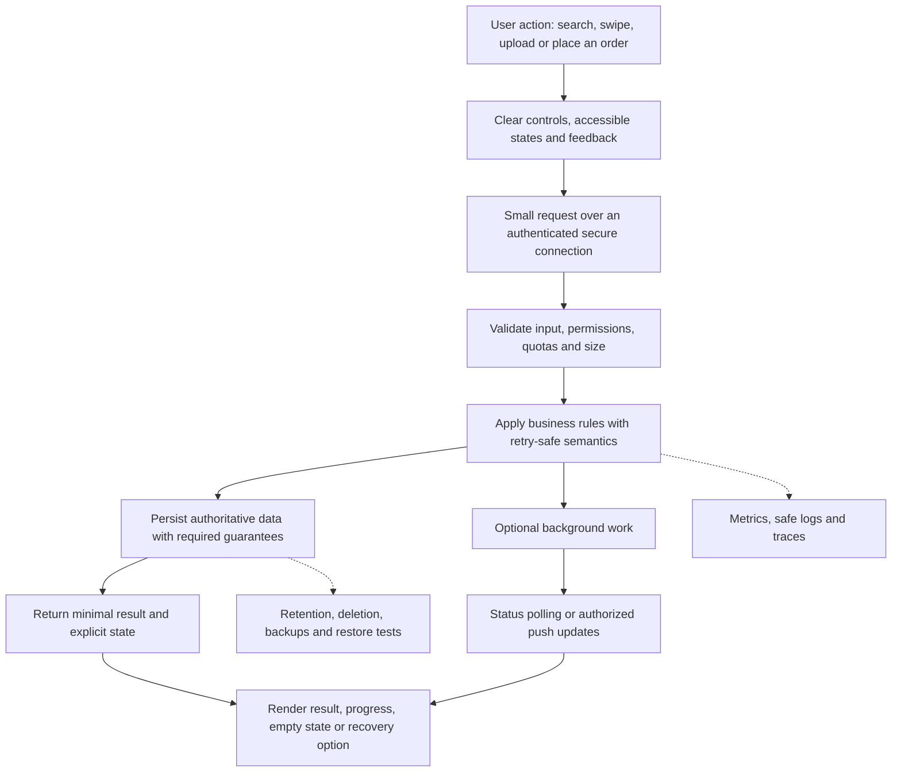

### A. User friendliness: what does the person experience?

| Ask this                                  | Design response                                                              | Example                                                                                       |
| ----------------------------------------- | ---------------------------------------------------------------------------- | --------------------------------------------------------------------------------------------- |
| What is the shortest path to the goal?    | Useful defaults, clear labels and few required decisions                     | eCycle starts near ten matches; a user can adjust radius instead of guessing a distance first |
| What happens while waiting?               | Show meaningful state and reserve layout space                               | Video says uploading, processing or ready; an order says pending acknowledgment               |
| Can the person recover?                   | Preserve input, explain actionable errors and offer safe retry               | Resume failed upload parts; use the same order ID when checking an uncertain submission       |
| What if there are no results?             | Explain and offer a relevant next action                                     | Expand radius or change categories; do not present an empty white screen                      |
| Does it work on mobile and slow networks? | Responsive layouts, large controls and a data-saving mode                    | Lower initial video quality and less prefetch on constrained connections                      |
| Can different people operate it?          | Keyboard navigation, semantic labels, focus management and text alternatives | Origin distinguished by shape plus label, not only color; captions and playback controls      |
| Can users control the experience?         | Explicit preferences and reversible actions where possible                   | Hide a creator, reset recommendations or pause autoplay                                       |

**Optimistic UI is a choice, not a universal improvement.** A like can update immediately and roll back on failure. An uploaded video cannot be advertised as ready before processing. An order must not show "filled" merely because the user tapped Buy. Name the intermediate states honestly.

Infinite scroll is convenient for discovery but makes navigation and recovery harder. Preserve the current item and scroll state on Back, avoid moving content under the user's pointer, and give users accessible controls rather than relying only on swipe gestures. Debounce typeahead and cancel outdated requests so old search responses cannot replace newer results.

### B. Security: identity, permission, abuse and privacy

**Authentication:** who is making this request? **Authorization:** may that person perform this operation on this specific object? Both apply to HTTP APIs, playback URLs, WebSocket subscriptions and background jobs acting on a user's behalf.

| Threat or requirement                  | Proposed control                                                                         | What the control does not solve                                                   |
| -------------------------------------- | ---------------------------------------------------------------------------------------- | --------------------------------------------------------------------------------- |
| User changes another user's object ID  | Load the resource and check ownership/role server-side                                   | Hiding a button is not authorization                                              |
| Stolen or leaked credentials           | TLS, short-lived scoped credentials, secret management and log redaction                 | TLS cannot protect a token already stolen through page script execution           |
| Private media leaks                    | Authorize playback, scope access to needed objects, expire grants and protect the origin | A signed manifest alone does not protect publicly accessible segment files        |
| Injection or malicious content         | Parameterized SQL, safe rendering, URL validation and sandboxed file processing          | One framework or ORM does not secure every raw query or render path               |
| Malicious crawler/upload input         | Block internal-network targets; limit redirects, file sizes and processing resources     | A filename or declared MIME type is not proof of safe file contents               |
| Spam, scraping and expensive API abuse | Per-user/IP quotas, bounded page sizes, concurrency limits and provider budgets          | Authentication alone does not prevent a legitimate account from abusing resources |
| Duplicate or forged interactions       | Authenticated actor, event IDs, validated payloads and replay-aware processing           | A client-reported watch event is not inherently trustworthy evidence              |
| Account takeover                       | Strong provider policies, recovery protections and MFA/step-up for sensitive actions     | MFA does not replace object-level permission checks                               |
| Data exposure in operations            | Minimize/redact logs, restrict access and record privileged actions                      | Backups and analytics copies can still contain sensitive data                     |

For a trading app, changing account details or withdrawal settings deserves stronger checks than reading a public price. For social video, moderation, block lists and age/region eligibility are part of serving correctness. For search, untrusted crawled pages must not execute as trusted content inside the results UI.

**Data minimization:** store only what the feature needs, keep precise location/history only for a justified period, and define user deletion behavior. Explain how deletion reaches primary data, indexes, caches, derived datasets and backup retention. Do not promise instantaneous removal from every backup if the actual policy only expires encrypted backups later.

**Encryption at rest** protects stored media under a defined key/access model; it does not prevent an authorized but overprivileged service from reading it. **CORS** controls browser cross-origin access; it does not stop a script or another server from calling an unprotected API.

### C. Storage: where does each type of data belong?

| Data                                                      | Reasonable starting store                               | Reason and tradeoff                                               |
| --------------------------------------------------------- | ------------------------------------------------------- | ----------------------------------------------------------------- |
| Users, permissions, video metadata and order reservations | Relational database                                     | Constraints and transactions; index for actual access patterns    |
| Video bytes, thumbnails, raw crawls and immutable exports | Object storage                                          | Large-file lifecycle and delivery; keep references in metadata    |
| Text retrieval structures                                 | Search index                                            | Efficient text retrieval; derived state must be rebuildable       |
| Temporary feed sessions and reusable results              | Bounded cache with TTL                                  | Low-latency ephemeral state; plan misses and eviction             |
| Interaction streams and replayable changes                | Event log plus long-term analytical storage as needed   | Decouple consumers; retention/partitions and replay cost matter   |
| Authoritative order-book working state                    | Ordered in-memory state backed by durable log/snapshots | Fast updates with explicit recovery; memory alone is insufficient |

**Efficiency techniques to explain:**

- **Normalize authoritative relationships first.** Store an owner once and reference the ID. Denormalize read views only when measurements justify faster reads and you have an update/rebuild strategy.
- **Choose indexes for queries.** An index on `(owner_id, created_at, id)` can support an owner's recent items with stable ordering. Every additional index consumes disk and adds write work; "index every column" is not a strategy.
- **Avoid unnecessary large values.** Do not repeatedly embed complete media in metadata rows or JSON responses. Base64 encodes three input bytes into four characters, roughly 33% overhead before other encoding/compression effects; use object references for large files.
- **Compress appropriately.** Compress text/index/log data where savings justify CPU cost. Already-compressed video often gains little from generic compression. Multiple video renditions increase storage deliberately to reduce playback bandwidth and buffering.
- **Set lifecycle policies.** Expire abandoned uploads, old temporary feed sessions and caches. Tier cold media only if slower retrieval is acceptable; archival storage is a poor default for a video users expect to play instantly.
- **Partition for a reason.** Time partitions help expire old events; user/instrument keys help localize specific access. A popular creator or instrument can still create a hot partition.
- **Back up and restore-test.** Replication copies accidental deletion too. Define backup retention, access, encryption, RPO/RTO and an actual restore drill.

**Do not confuse fewer bytes with better performance.** A denormalized view may intentionally duplicate small fields to avoid expensive joins. A compressed format can save network bandwidth while adding CPU latency. Name the workload and measure the total cost.

### D. Data transfer: send less, at the right time

| Technique                               | Where it helps                                    | Tradeoff / failure to consider                                   |
| --------------------------------------- | ------------------------------------------------- | ---------------------------------------------------------------- |
| Field projection                        | Return titles/thumbnails before full metadata     | More endpoint/query design; avoid a separate request per field   |
| Cursor pagination and maximum page size | Search, discussions and feeds                     | Cursor expiry and changing datasets need a contract              |
| Compression for text responses          | Large JSON, HTML and text assets                  | CPU overhead; small responses may not benefit much               |
| CDN and cache validators                | Reusable media/static assets; unchanged resources | Private cache keys, invalidation and freshness                   |
| Direct uploads/downloads                | Large video files                                 | Scoped grants, content validation and origin access rules        |
| Resumable/multipart upload              | Unstable networks and large files                 | Track parts, integrity and abandoned upload cleanup              |
| Batching small events                   | Analytics interaction reporting                   | Added delay; batches need size limits and partial-error handling |
| Incremental updates or deltas           | Price streams and changing state                  | Missing a delta requires snapshot/replay recovery                |
| Bounded prefetch                        | Smooth video swiping and likely-next navigation   | Unused data, battery and decoder/memory pressure                 |
| Adaptive media quality                  | Heterogeneous bandwidth/devices                   | Encoding/storage complexity and quality switches                 |

**Worked transfer example:** suppose each feed item has 2 KB of metadata and its video is 5 MB. Returning 10 metadata items costs about 20 KB; downloading all ten videos immediately costs 50 MB. A user who watches only one wastes most of those prefetched bytes. Return metadata first, fetch the current stream, and prefetch only a bounded portion of likely-next content. These are illustrative decimal units, not measurements.

**Push versus polling:** occasional job status can use bounded polling with backoff. A live price display may use WebSockets to avoid repeated empty polls. WebSockets add connection state, authentication renewal, heartbeats, reconnect recovery and slow-consumer backpressure. They are not automatically better for ordinary search requests.

A price display can conflate rapid updates into the latest price. An execution ledger cannot discard intermediate fills just because a newer message exists. Choose transfer semantics according to whether every event matters.

### E. Reliability, observability and cost

Set timeouts and bounded retries with backoff/jitter; retry only when the operation is safe or idempotent. Avoid retries at every layer multiplying one request into dozens. Use overload limits and dependency isolation so one slow transcoder/ranker/provider does not exhaust all request capacity.

Distinguish **technical metrics** (latency, error rate, queue age, CPU, cache hit rate) from **user outcomes** (successful search, time to first video frame, completed upload, accurately reconciled order). Correlate requests/jobs using IDs without logging passwords, bearer tokens or unnecessary personal data.

| Design                  | Likely major cost                                                    | First useful efficiency question                                     |
| ----------------------- | -------------------------------------------------------------------- | -------------------------------------------------------------------- |
| Search                  | Crawling, indexing, ranking and replicated index storage             | Which pages/queries deserve expensive processing and freshness?      |
| YouTube-style video     | Delivery bandwidth, retained media and encoding                      | Which renditions and retention periods are actually needed?          |
| Short-video feed        | Media delivery, ranking and high-volume events                       | How much prefetch is unused, and which events/features are valuable? |
| HFT execution           | Specialized infrastructure, connectivity and operational reliability | Which measured latency budget justifies dedicated hardware?          |
| Small eCycle deployment | External API calls, database capacity and hosting availability       | Can repeated work be avoided while preserving privacy and freshness? |

**The interview sentence to practice:** "For this requirement I chose X because it improves Y. It costs Z, so I would monitor M and switch to alternative A when condition C appears." Example: "I use a CDN because many viewers request identical video segments. It adds invalidation and access-control complexity, so I track origin traffic and private-media failures; I would consider multiple CDNs only when geography, reliability or measured cost justifies the operational work."

## 13. HTTP and API Fundamentals: Status-Code Interview Questions

Added Sep 23, 2026. **Why:** system-design diagrams assume networking and OS knowledge the earlier syntax notes do not explain. **Benefit:** question-and-answer drills connect definitions to diagnosis. **Limitations:** simplified flows vary by protocol, OS and runtime; these are study examples, not tested deployments. **Alternative:** memorizing status/OS definitions is shorter but does not explain what to inspect or how to recover. Existing notes are preserved; these additions supply the missing context.

### Headers, query parameters, path and body

```python
import requests

response = requests.get(
    "https://api.example.com/videos/42",
    headers={"Authorization": "Bearer TOKEN", "Accept": "application/json"},
    params={"include": "captions", "language": "en"},
    timeout=(3, 10),  # connect/read timeouts, not a total wall-clock deadline
)
```

```http
GET /videos/42?include=captions&language=en HTTP/1.1
Host: api.example.com
Authorization: Bearer TOKEN
Accept: application/json
```

| Part                      | Meaning                                            | Are the names fixed?                                                  |
| ------------------------- | -------------------------------------------------- | --------------------------------------------------------------------- |
| Path`/videos/42`        | Resource and identifier                            | The API defines its routes                                            |
| Query`include=captions` | Options such as filtering, sorting and pagination  | The endpoint defines supported names, types and values                |
| Headers                   | Request metadata and credentials                   | Some names have standard meanings; APIs can define additional headers |
| JSON body                 | Structured input, often for creating/updating data | The endpoint's schema defines accepted fields                         |

`params=` is a fixed argument name in Python `requests`. Its dictionary keys are API-specific. An invented key may be ignored or rejected; it does not create a feature. `?` starts the URL query and `&` separates parameters. `json=payload` sends a JSON body; it is not interchangeable with `params=payload`. `Accept` describes desired response formats; `Content-Type` describes the format of the message body being sent. Secrets should not go in query strings because URLs commonly appear in histories and logs; headers still require HTTPS and careful logging.

### "Status = XXX: client-side or server-side problem?"

**First answer:** classify the response, then diagnose the cause. A status is emitted by a server/proxy; "client error" means the request cannot be fulfilled under that response's semantics, not necessarily that the frontend developer made a mistake. A stale server schema can cause 422. A malformed client input can expose a backend bug that produces 500.

| Family | Meaning                                     | Interview interpretation                                 |
| ------ | ------------------------------------------- | -------------------------------------------------------- |
| 1xx    | Interim information                         | Processing is continuing; usually not the final response |
| 2xx    | Successful handling                         | Read the endpoint contract for what actually completed   |
| 3xx    | Redirection/cache-related response          | Not automatically an error                               |
| 4xx    | Request rejected on the client/request side | Check credentials, URL, input, state and limits          |
| 5xx    | Server could not fulfill the request        | Check application, gateway and upstream dependencies     |

| Status    | Short answer                                | First check                                                   |
| --------- | ------------------------------------------- | ------------------------------------------------------------- |
| 200       | Successful response                         | Does the body match the expected contract?                    |
| 201       | Resource created                            | Created ID/location                                           |
| 202       | Accepted for processing                     | Job/order status; completion is not promised                  |
| 204       | Success without response content            | Do not call`.json()` on an empty body                       |
| 301 / 308 | Permanent redirect                          | Target URL; 308 preserves method/body                         |
| 302 / 307 | Temporary redirect                          | 307 preserves method/body; 302 may turn POST into GET         |
| 304       | Cached representation can be reused         | Conditional request and local cached body                     |
| 400       | Bad request                                 | Syntax or invalid request construction                        |
| 401       | Missing/invalid authentication              | Bearer token expiry, credentials and authentication challenge |
| 403       | Request understood but forbidden            | Role, ownership or policy; login alone may not fix it         |
| 404       | Target not found, or deliberately concealed | Path, resource ID, deployment and visibility                  |
| 405       | Method unsupported for this resource        | GET versus POST; inspect`Allow`                             |
| 409       | Conflict with current state                 | Duplicate key or incompatible resource state                  |
| 413       | Request content too large                   | Proxy and application upload limits                           |
| 415       | Unsupported media type                      | JSON versus form body and`Content-Type`                     |
| 422       | Semantically unprocessable content          | Field names/types and validation errors                       |
| 429       | Too many requests                           | Quota; honor`Retry-After` when supplied                     |
| 500       | Unexpected server failure                   | Correlated application error logs                             |
| 502       | Gateway got an invalid upstream response    | Proxy-to-application connection/response                      |
| 503       | Service currently unavailable               | Capacity, maintenance, readiness or dependency failure        |
| 504       | Gateway timed out waiting upstream          | Upstream latency and timeout boundaries                       |

Status meanings follow [HTTP semantics](https://www.rfc-editor.org/rfc/rfc9110.html) and the [MDN status reference](https://developer.mozilla.org/en-US/docs/Web/HTTP/Reference/Status). The checks above are diagnostic starting points, not guaranteed root causes.

### Quick oral drills

- **401 versus 403?** Valid credentials may resolve 401. For 403, the operation is forbidden under current policy; refreshing the token repeatedly is not a permission strategy. HTTP's name "Unauthorized" for 401 is confusing: think authentication.
- **502 versus 504?** Invalid upstream response versus upstream timeout. The gateway may generate either even when your handler never returns a response.
- **Is 404 always a frontend bug?** No. The record can be deleted, the deployed route can be missing, or the server can hide a resource's existence.
- **500 after I send bad input: whose bug?** The input may be wrong, but expected input failures should be handled; inspect both request validation and the server crash.
- **202 from an order endpoint means filled?** No. It may mean queued only. Query the authoritative lifecycle state.
- **No `status_code` at all?** DNS, connection refusal, TLS failure or a client timeout can occur before an HTTP response arrives. These are not inherently HTTP 500 errors.
- **Browser shows a CORS error?** The browser may block JavaScript from accessing a response even though the server processed the request. Inspect the network/preflight exchange; CORS is not an HTTP status code.
- **Can I retry a POST after timeout?** Its outcome is unknown. Use an idempotency key and status lookup where supported; blindly repeating it may duplicate the effect.

**Debug sequence:** capture method/URL and a redacted request → inspect response status/body/headers and request ID → identify which hop produced it → check matching server/proxy logs → reproduce with minimal input → change the cause, not just the displayed message. Never paste real bearer tokens into public debugging tools.

### Methods, safety and idempotency

**Safe** means intended to retrieve without requesting a state change; logging can still occur. **Idempotent** means repeating the same operation has the same intended effect, not necessarily the same status code. GET is safe/idempotent; PUT and DELETE are idempotent by semantics; POST and PATCH are not generally guaranteed idempotent. An API can implement POST idempotency explicitly. A second DELETE can return 404 even though the resource remains deleted.

`response.raise_for_status()` catches HTTP error responses, not all application-level failure contracts. A 200 JSON response could still carry an application error; a successful non-JSON response can make `.json()` fail. Check the documented response shape as well as the status.

## 14. Networking Brush-up and Browser Request Flows

### TCP versus UDP

| Question                   | TCP                                                             | UDP                                                             |
| -------------------------- | --------------------------------------------------------------- | --------------------------------------------------------------- |
| What does the app receive? | Ordered stream of bytes                                         | Individual datagrams/messages                                   |
| Setup?                     | Connection state and handshake                                  | No transport connection handshake                               |
| Delivery/order?            | Retransmission and in-order delivery while the connection works | No built-in guarantee of arrival, order or uniqueness           |
| Message boundaries?        | Not preserved; the application frames messages                  | Datagram boundaries preserved                                   |
| Flow/congestion handling?  | Built-in mechanisms                                             | Application/protocol must provide suitable controls             |
| Example fit?               | Reliable stream protocols, HTTP/1.1 and HTTP/2                  | Real-time datagrams, some DNS traffic, QUIC transport substrate |

TCP cannot guarantee delivery through permanent failure, nor prove a server committed a business transaction. A TCP acknowledgment concerns transport receipt, not "payment succeeded." Its reliable ordered byte-stream contract is specified in [RFC 9293](https://www.rfc-editor.org/info/rfc9293/).

**Why use UDP?** An application may value fresh updates over waiting to recover old data, or implement its own transport behavior. UDP is not universally faster or always lossy; its lack of guarantees gives the application responsibility. Large datagrams risk fragmentation, so protocol design must consider path limits.

**Trap: "YouTube uses UDP because it is video."** Recorded video is commonly delivered over HTTP. Live interactive audio/video has different latency/loss tradeoffs. Choose based on the delivery protocol, not the content label.

**HTTP/3 uses QUIC over UDP.** QUIC supplies encryption, congestion control and reliable streams itself; using UDP underneath does not make an HTTP response unreliable. Loss on one stream need not block delivery on another stream in the same way as TCP's shared ordered stream, although streams still share connection resources. [QUIC specification](https://www.rfc-editor.org/info/rfc9000/).

### TCP handshake and framing

```mermaid
sequenceDiagram
    participant C as Client
    participant S as Server
    C->>S: SYN with initial sequence number
    S->>C: SYN-ACK with server sequence number
    C->>S: ACK
    Note over C,S: Connection established; application exchange follows
```

**Why three messages?** Each side synchronizes sequence state and demonstrates receipt of the peer's setup message. TCP setup is distinct from TLS authentication/encryption setup.

**One `send()` equals one `recv()`?** No. If a sender writes two messages, a receiver can read them combined or in smaller chunks. Define length prefixes, delimiters or another framing format. Handle partial writes/reads; TCP does not supply application message boundaries.

**Flow control versus congestion control:** flow control protects the receiver's capacity; congestion control adapts to the network path. **Bandwidth versus latency:** a wide pipe can move a large file quickly while the first response still takes a long round trip. Throughput is the rate actually achieved.

### "What happens when you type a URL and press Enter?"

**Thirty-second answer:** "The browser parses the URL, checks available local state, resolves the host when needed, establishes or reuses a secure connection, sends an HTTP request, and receives a response. It follows redirects if required, parses HTML, fetches referenced resources and builds/layouts/paints the page. JavaScript can then issue API calls and update the UI."

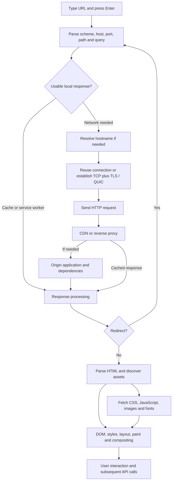

This is a conceptual path, not a rigid serial pipeline: parsing, resource fetching and rendering can overlap. Cached DNS, an existing connection or cached assets skip work. A service worker, if installed and controlling the page, can intercept fetches.

1. **Parse:** for `https://example.com:443/search?q=cat#results`, the hostname is `example.com`, path `/search`, query `q=cat`. The fragment `#results` is handled locally and is not sent as part of the HTTP request target.
2. **DNS:** a cached answer may exist. Otherwise a recursive resolver obtains the answer, potentially consulting root, TLD and authoritative servers. The browser does not independently contact every DNS layer for every page. Answers can involve aliases and multiple IPv4/IPv6 addresses.
3. **Reach destination:** packets travel through the local network and routers toward the endpoint. DNS finds addresses; IP routing moves packets. They solve different problems.
4. **Connect securely:** a new HTTPS connection using HTTP/1.1 or HTTP/2 generally involves TCP followed by TLS. TLS checks the server certificate/hostname and negotiates protected communication. HTTP/3 uses QUIC instead. Protocol selection, resumption and connection reuse affect the exact steps.
5. **Request and server handling:** method, target and headers reach an edge/proxy/origin. Cookies may be sent subject to their scope/policies. The application may validate access, query storage or call another service.
6. **Render:** HTML produces the DOM, CSS contributes styling, layout computes geometry, paint produces visual output and compositing combines layers. JavaScript can block parsing or modify the page, depending on how it is loaded/executed. The browser can show useful content before every resource finishes.

Browser pipeline reference: [MDN browser internals overview](https://developer.mozilla.org/en-US/docs/Web/Performance/Guides/How_browsers_work). HTTPS protects data in transit and authenticates the endpoint under the certificate trust model; it does not prove the business is trustworthy or its application secure. [TLS overview](https://developer.mozilla.org/en-US/docs/Web/Security/Defenses/Transport_Layer_Security).

### "What happens when you Google something?"

Separate **getting a request to Google** from **finding relevant results**:

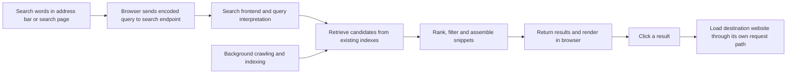

The generic browser/DNS/connection flow applies, often with connection reuse because the search page is already open. The search service uses a previously built index, not a fresh crawl of the entire web per query. Clicking a result initiates navigation to the destination; it is a separate operation from ranking it. Query interpretation and the exact response format vary. See section 7 for the proposed search architecture and Google's linked public explanation.

### More networking questions interviewers ask

| Question                            | Answer direction                                                                                                                               |
| ----------------------------------- | ---------------------------------------------------------------------------------------------------------------------------------------------- |
| What is DNS?                        | Name-to-record lookup system, including address records; caching/TTL balance lookup overhead and update freshness                              |
| Is DNS always UDP?                  | No. DNS supports TCP too, and encrypted transports such as DNS over HTTPS/TLS exist                                                            |
| IP address versus port?             | Address identifies a network endpoint/interface; port helps select a transport endpoint/service on a host                                      |
| MAC versus IP?                      | MAC addresses support local-link delivery; IP supports routing between networks; ARP resolves IPv4 neighbors and IPv6 uses Neighbor Discovery  |
| Router versus switch?               | Typically routes IP between networks versus forwards link-layer frames within a network; real devices may combine functions                    |
| What is NAT?                        | Rewrites address/port mappings, often letting private hosts share a public address; it complicates inbound reachability                        |
| HTTP versus HTTPS?                  | HTTP semantics with transport protection for HTTPS; HTTPS does not replace application authorization                                           |
| HTTP/1.1 versus 2 versus 3?         | Persistent HTTP/1.1 connections; HTTP/2 multiplexes streams over TCP; HTTP/3 uses QUIC streams                                                 |
| Cookie versus session?              | Cookie is a browser storage/transport mechanism; session is application login/state. A cookie may hold a session ID, but they are not synonyms |
| What is CORS/preflight?             | Browser cross-origin response-access rules; qualifying requests trigger an OPTIONS preflight; not every cross-origin request does              |
| Load balancer versus reverse proxy? | Roles overlap: proxy fronts upstream services; balancing distributes requests/connections across them                                          |
| Why WebSockets?                     | Persistent bidirectional messaging; useful for live updates, but requires reconnect, authentication and backpressure design                    |
| Is`ping` enough?                  | No. ICMP may be blocked, and a responding host does not prove the HTTPS application/database is healthy                                        |

For debugging: `nslookup`/`Resolve-DnsName` for name resolution, `curl -v` for HTTP/TLS inspection without leaking credentials, `Test-NetConnection host -Port 443` on Windows for reachability, and browser DevTools for timings/requests. A successful port connection is only one layer of evidence. HTTP-version reference: [MDN HTTP evolution](https://developer.mozilla.org/en-US/docs/Web/HTTP/Guides/Evolution_of_HTTP).

## 15. Operating Systems: Interview Questions and Concurrency

### What does an OS do?

It manages CPU execution, memory, devices and persistent storage while isolating programs and providing abstractions such as processes, files and sockets. **User mode** restricts application privileges; **kernel mode** permits privileged operations. A **system call** is a controlled entry into kernel services, for example reading a file or creating a socket. A system call does not necessarily switch to a different process.

### Process versus thread

| Aspect          | Process                                                                    | Thread                                                        |
| --------------- | -------------------------------------------------------------------------- | ------------------------------------------------------------- |
| Basic meaning   | Running program instance with resources/address space                      | Execution stream within a process                             |
| Memory          | Usually isolated virtual address space; explicit shared memory is possible | Shares process code, heap and resources                       |
| Execution state | Contains one or more threads                                               | Has its own registers, instruction position and stack         |
| Communication   | IPC: pipes, sockets, shared memory, etc.                                   | Shared memory or thread-safe queues                           |
| Isolation       | Stronger boundary; crash usually isolated from other processes             | Memory corruption/fatal failure can affect the entire process |
| Overhead        | Often more creation/memory/communication overhead                          | Often lighter, but locking and scheduling are not free        |

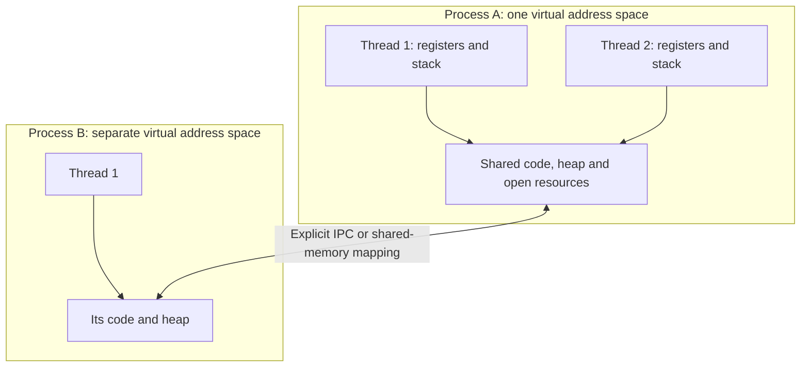

**Concurrency versus parallelism:** concurrency means tasks make overlapping progress, possibly by taking turns on one core. Parallelism means executing simultaneously, requiring multiple execution resources. Ten threads on one core are concurrent, not ten-way CPU parallelism.

**Context switch:** save one execution context and resume another. Costs include scheduler work and disturbed CPU caches/TLB state. More threads can reduce throughput if contention/switching dominates. A thread switch within a process usually avoids changing address spaces, but it is still not free.

### Race condition versus deadlock

**Race condition:** correctness depends on an uncontrolled ordering of events. **Data race:** a narrower concept involving conflicting memory accesses without required synchronization; precise definitions depend on the language memory model. A race can also happen across multiple database requests without two threads directly sharing a variable.

Example of lost update, assuming these read/modify/write steps can interleave:

```text
Counter initially 0
Thread A reads 0
Thread B reads 0
Thread A writes 1
Thread B writes 1
Expected after two increments: 2. Actual: 1.
```

**Prevention:** protect the complete invariant with a lock, use an appropriate atomic operation, transfer ownership through a queue, or avoid mutable shared state. For database changes, use atomic updates/constraints/transactions at the correct isolation level. A lock in one web process does not coordinate other workers or servers.

```python
from threading import Lock

counter = 0
counter_lock = Lock()

def increment():
    global counter
    with counter_lock:
        counter += 1
```

All accesses that participate in the invariant must follow the same synchronization discipline. For a check-then-act operation, locking only the write is not enough. Database example: decrement stock with `UPDATE ... SET stock = stock - 1 WHERE id = ? AND stock > 0`, then check affected rows; a preceding unlocked read of stock is not a reservation.

**Deadlock:** participants wait forever for resources/events that can only be released by each other. The program need not consume high CPU; blocked threads often consume little.

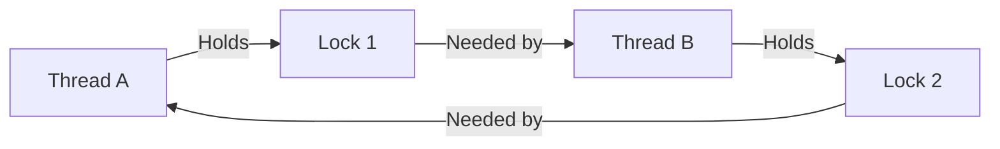

Classic resource-deadlock conditions are mutual exclusion, hold-and-wait, no forced preemption of held resources, and circular wait. Preventing one of these conditions prevents this class of deadlock. **Consistent global lock ordering** is a practical way to remove circular wait: both threads acquire Lock 1 before Lock 2. Release reliably with context managers/RAII/finally. Avoid blocking network calls or unknown callbacks while holding locks.

Try-lock/timeouts with release and retry can support recovery, but retrying in synchrony can cause **livelock**. A timeout alone is not proof the underlying state is safe. Databases may detect cycles, abort one transaction and require a safe retry. **Starvation** means one participant keeps losing access while others progress; fairness/aging may help. **Livelock** means participants keep acting but make no useful progress.

### Mutex, semaphore, condition variable and spinlock

| Primitive          | Use                                                       | Pitfall                                                                          |
| ------------------ | --------------------------------------------------------- | -------------------------------------------------------------------------------- |
| Mutex/lock         | One participant at a time protects shared state           | Too-large critical sections reduce concurrency; wrong order deadlocks            |
| Counting semaphore | Limit concurrent access to N resources                    | Missing permit release leaks capacity; not a substitute for all state protection |
| Condition variable | Wait for a predicate while coordinating with a lock       | Recheck the predicate in a loop after waking                                     |
| Spinlock           | Busy-wait for a very short critical section               | Wastes CPU, especially if owner is descheduled                                   |
| Atomic operation   | Indivisible operation with defined memory-order semantics | Does not automatically make a multi-variable invariant atomic                    |

Condition-variable pattern: acquire lock → **while** predicate false, wait (atomically release lock and sleep) → on wake, reacquire lock and check again → use shared state. A notification is not the predicate itself; another thread may consume the resource first. For ordinary producer/consumer Python code, prefer a bounded `queue.Queue` instead of implementing this machinery yourself. Lock and condition-variable background: [OSTEP locks](https://pages.cs.wisc.edu/~remzi/OSTEP/threads-locks.pdf), [condition variables](https://pages.cs.wisc.edu/~remzi/OSTEP/threads-cv.pdf).

### CPU-bound, I/O-bound, threads, processes and async

| Workload                                                      | Useful starting approach                              | Reason                                                               |
| ------------------------------------------------------------- | ----------------------------------------------------- | -------------------------------------------------------------------- |
| Waiting for external HTTP/database calls                      | Async I/O with compatible clients, or bounded threads | Overlap waits                                                        |
| Heavy pure-Python CPU computation on a conventional GIL build | Processes or optimized native computation             | Use multiple cores without relying on Python thread CPU parallelism  |
| Native computation that releases the GIL                      | Threads may help                                      | Benchmark the actual library/runtime                                 |
| Long-running independent job                                  | Background worker with durable job state if required  | Request cancellation/restart should not silently lose necessary work |

**Does Python's GIL make your code thread-safe?** No. In conventional GIL-enabled CPython, it limits concurrent Python bytecode execution in one interpreter; it does not protect your multi-step business invariants. I/O and some native extensions release it. Free-threaded builds also exist, so state the runtime assumption rather than saying "Python can never run threads in parallel." [Python thread-state/GIL documentation](https://docs.python.org/3.14/c-api/threads.html).

**Can one event-loop thread have races?** Yes: two coroutines can interleave across `await` between checking and updating state. **Does `async` accelerate a CPU loop?** No; a long computation without yielding can stall the event loop. **Does cancellation kill all work instantly?** No; cleanup/cooperation and external side effects require explicit handling.

For eCycle, ordinary FastAPI `def` handlers use a thread pool, while the current SQLAlchemy/HTTP clients are synchronous. Multiple requests can progress, but pool/connection limits still bound capacity. Switching to `async def` without changing blocking calls is not an optimization.

### Memory questions

| Question                             | Answer                                                                                                                                                                                         |
| ------------------------------------ | ---------------------------------------------------------------------------------------------------------------------------------------------------------------------------------------------- |
| Stack versus heap?                   | Stack frames track calls/local execution state; heap supports dynamically managed allocations. Objects referenced by a local Python variable are not necessarily stored on that thread's stack |
| Virtual versus physical memory?      | A process uses virtual addresses mapped to physical frames or other backing state; this supports isolation and flexible allocation                                                             |
| What is a page?                      | Fixed-size unit used for memory mapping; size is platform/configuration dependent                                                                                                              |
| What is a page fault?                | Hardware traps because an access needs OS handling; could be demand allocation, copy-on-write, loading a page, or an invalid access—not always disk I/O                                       |
| What is the TLB?                     | CPU cache of address translations; a TLB miss is not automatically a page fault                                                                                                                |
| What is swapping/thrashing?          | Moving memory pages to backing storage; excessive page churn can destroy performance when active working sets exceed available memory                                                          |
| Memory leak versus dangling pointer? | Retained/unreleased memory versus a reference to storage whose lifetime ended; managed languages can leak reachable objects too                                                                |
| What is copy-on-write?               | Share a page until a write requires a private copy; useful for efficient process/memory operations                                                                                             |
| What is false sharing?               | Threads update distinct values on the same cache line, causing coherence traffic; layout/padding can help after profiling                                                                      |

### Scheduling, IPC and storage questions

- **Ready versus running versus blocked?** Ready can run but is waiting for CPU; running is executing; blocked waits for an event/resource. Busy polling stays runnable rather than sleeping efficiently.
- **Preemptive versus cooperative scheduling?** The scheduler can interrupt execution versus tasks yield voluntarily. An OS can preempt the thread that hosts a cooperatively scheduled event loop.
- **Priority inversion?** A high-priority task waits on a low-priority lock holder while medium-priority work delays that holder. Priority inheritance can mitigate this where supported.
- **How do processes communicate?** Pipes, sockets, message queues or shared memory. Shared memory avoids some copying but still needs synchronization and ownership rules.
- **`fork` versus `exec`?** On Unix-like systems, `fork` creates a child process with a logically copied address space, often copy-on-write; `exec` replaces the current process image. Do not assume Windows process creation works identically.
- **Zombie versus orphan?** On Unix, a zombie has exited but still has status awaiting collection; an orphan's parent exited. They are not synonyms for a currently running runaway process.
- **File descriptor?** A process-local handle to an open resource such as a file/socket on Unix-like systems. Leaks can hit limits even when RAM/CPU look fine.
- **Write returned: is data durable?** Not necessarily. Data may be in user-space buffers or the OS page cache. Flush/fsync and storage guarantees differ; robust file replacement may also require directory metadata durability.
- **Container versus VM?** Containers typically isolate processes while sharing a host kernel; VMs provide a virtual machine running a guest kernel. Isolation, overhead and operational tradeoffs differ.
- **Why can't a thread pool grow without limit?** Memory stacks, scheduling, lock contention and downstream connections are finite. Bound concurrency and queues; reject/defer overload deliberately.

Foundational reading and exercises: [Operating Systems: Three Easy Pieces](https://pages.cs.wisc.edu/~remzi/OSTEP/) and [its practice simulators](https://pages.cs.wisc.edu/~remzi/OSTEP/Homework/homework.html). The questions here are a study checklist; verify OS/runtime-specific behavior rather than treating every platform as identical.

### Mock interview: diagnose instead of reciting

| Symptom/question                       | Useful first reasoning                                                                                         |
| -------------------------------------- | -------------------------------------------------------------------------------------------------------------- |
| API slow, CPU low                      | Waiting on network, database, locks, connection pools or downstream queues; inspect timings/stacks             |
| CPU high, throughput low               | Could be busy wait, expensive computation, retries or contention; profile instead of assuming deadlock         |
| "Adding threads made it slower"        | Examine shared locks, GIL/runtime behavior, context switches and downstream saturation                         |
| Two users bought the final item        | Check transaction/conditional update; frontend button disabling cannot protect shared stock                    |
| Program freezes only sometimes         | Capture thread stacks and lock ownership; distinguish deadlock, slow I/O and starvation                        |
| Browser works, Python request gets 401 | Compare authentication/cookies and request contract, not merely the URL                                        |
| HTTP 200 but page blank                | Inspect JavaScript errors, response shape, asset loading and rendering; HTTP success is not end-to-end success |
| Order request timed out                | Reconcile by stable order/request ID; do not infer it never executed                                           |

Practice each answer as **definition → concrete example → failure mode → prevention → tradeoff**. Then connect it to a real request or shared-state operation in eCycle.
