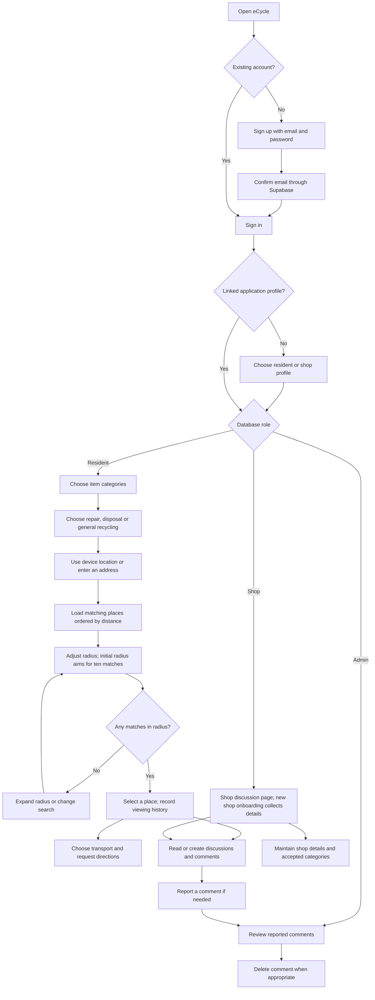
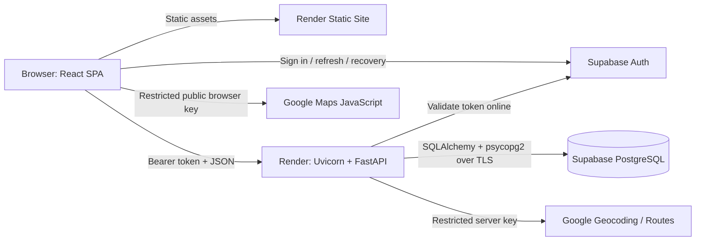
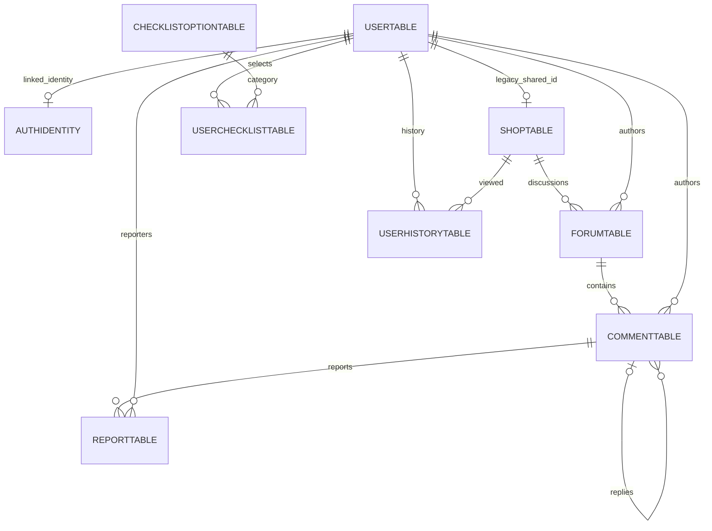

# eCycle: SWE interview study guide

**Search update (22 September 2026):** [Radius search](RADIUS_SEARCH.md) supersedes the original five-nearest/top-k implementation described in historical examples below. The API now returns all matching places sorted by full-precision `(distance, shopid)`; React chooses an initial radius reaching the tenth match (or furthest available), rounded up to 0.1 km, and filters immediately when the slider moves. Ties can include more than ten. Current complexity is O(M) geodesic computation, O(M log M) sorting, O(M) payload/memory and O(M) per client-side radius change, with no extra search HTTP/SQL calls during sliding. There are still three SQL statements in the search regression test. Large-directory PostGIS filtering/pagination is proposed. Train retains the TRANSIT API value with Google's RAIL preference, and the origin uses a blue circular marker. Use these current facts in interviews rather than claiming the previous top-five limit remains.

Code reviewed: 22 September 2026. This is a study guide for the current repository, not a claim of production scale. Read alongside [setup/recovery](SETUP_AND_RECOVERY.md), [upgrade history](UPGRADE_PLAN.md), [Auth decisions](AUTH_UPGRADE.md) and [location integration](LOCATION_DIRECTIONS_UPGRADE.md).

## How to use this guide

For every answer, practice this structure: **requirement → decision → mechanism → evidence → tradeoff → next step**. Start with a 30-second answer; expand when asked. Explain the code in your own words rather than reciting technology names.

Labels throughout:

- **Implemented:** supported by the current source.
- **Verified historically:** a check recorded in this repository's September 22 logs; not a current production measurement.
- **Proposed:** a design you can discuss, not something to claim you already built.

Before writing this guide, the four learning questions are: **Why change?** Existing documents explain individual upgrades but not how to defend the whole system. **Benefit?** A code-linked study path, complete API inventory, query walkthroughs and adversarial follow-ups. **Limitations?** Reading cannot replace implementing/debugging; source and hosting policies change. **Alternatives?** A generic system-design cheat sheet is easier to write but misses this project's actual bottlenecks; a slide deck helps presentation but is insufficient for code-level preparation. This guide changes documentation only.

## 1. Your project introduction

### User stories and end-to-end flow (23 September 2026)

**Learning questions for this addition:** The existing architecture diagram shows services but does not explain how a person completes a task or where access is checked. The new flow and authentication sequence connect those decisions to the actual screens and API. Diagrams simplify retries and describe source behavior, not verified production state. Mermaid was chosen over screenshots or an external diagram tool because its text can be reviewed and updated with the code; a Markdown viewer with Mermaid support is needed to render it.

| Actor | User story | Current outcome |
| --- | --- | --- |
| Resident | As a resident, I want a nearby place accepting my items so I can repair or recycle them. | Select categories and service, search from a device/address origin, adjust radius, choose a place and request directions. |
| Shop | As a shop operator, I want to maintain my location and accepted items so residents can find my services. | Create a shop profile, supply shop details, maintain accepted categories and participate in location discussions. |
| Admin | As an administrator, I want to review reported comments so I can moderate inappropriate content. | Open reports and delete comments where permitted; admin status is not available through public signup. |



The report arrow represents a moderation handoff, not the resident gaining access to the admin screen. Each protected step can fail authentication or authorization. Device-location denial can be handled by entering an address; empty results can require a different category/service/origin, not just a larger radius. Routes are optional after selecting a place. Viewing history does not prove a visit, and discussion points do not measure recycling impact. The origin is a blue circle, distinct from destination pins. Train requests rail-preferred transit, not guaranteed rail-only journeys.

Source trail: [routing](../frontend/ecycle-app/src/App.js), [login and role landing pages](../frontend/ecycle-app/src/pages/LoginUI/Login.js), [map flow](../frontend/ecycle-app/src/pages/MapUI/Map.js), [shop API](../backend/controllers/shop_controller.py), [moderation API](../backend/controllers/report_controller.py).

### “Tell me about a project you built.”

Suggested answer, adapted to your actual contribution:

> eCycle helps Singapore residents find places to repair or recycle items. Users select categories, choose a service, and adjust a search radius to find matching locations by straight-line distance. They can then request travel directions, view location discussions and report comments. The frontend is React, the API is FastAPI, and PostgreSQL and authentication are hosted on Supabase. I modernized a legacy application incrementally: preserving its data and workflows while adding server-side authorization, typed request validation, a bounded-query search and a more usable map interface. The important work was making the boundaries and failure behavior explicit, not just changing frameworks.

Say which parts you personally designed, reviewed and verified. If asked about AI assistance, explain it accurately and demonstrate your understanding through code, tests and tradeoffs. Do not imply independent authorship of work you cannot explain.

### What problem does it actually solve?

Item-category compatibility plus proximity: a place is useful only if it accepts the selected items and offers the requested service. Routes help the user reach a selected place. Discussion supports local context; it does not verify that a facility is currently open or licensed.

**Product precision:** `general` means general recycling, `dispose` is the electronics-disposal flow, and `repair` is repair. History means recently viewed places, not completed recycling visits. Points measure discussion activity, not waste diverted or carbon saved. The app currently requires sign-in even for discovery; guest discovery is proposed.

### What evidence can you cite?

| Evidence | Defensible claim | What it does NOT establish |
| --- | --- | --- |
| Historical restore | 718 locations, nine categories, 740 legacy user/shop rows, 3,801 category associations imported and value-checked | 740 active users; current accuracy of every location |
| `test_search.py` | Three SQL statements for a fixture search: identity lookup plus two search statements | Constant runtime, production p99, arbitrary dataset scalability |
| Last recorded regression runs | 85 backend tests; 30 frontend tests | Exhaustive correctness or PostgreSQL concurrency coverage |
| Live Routes sample | One walking route returned 632 m, five instructions and an encoded polyline | All travel modes, live mobile UX or provider availability |
| Browser fixture review | Core UI checked at 1440, 390 and 320 pixels | Real Google map chrome or full production authentication |
| SQL schema/access checks | Nine tables with RLS enabled and denied browser-role table access after restore | Fine-grained RLS enforcement inside the privileged backend |

No load-test throughput, production user count, latency improvement percentage, uptime SLO achievement or cost savings has been measured. Do not invent one.

## 2. Architecture you should draw from memory



The deployment design uses these services; local source inspection does not establish which commit or variables a particular Render service currently runs. Check its dashboard to make a live-deployment claim.

### Boundary responsibilities

| Layer | Responsibilities | Must not be trusted for |
| --- | --- | --- |
| React | Inputs, visual state, sessions via SDK, navigation, map rendering | Granting roles or proving ownership from localStorage |
| FastAPI | Identity validation, permission checks, validation, business rules, provider adapters | Assuming the UI already validated a request |
| PostgreSQL | Persistence, primary/foreign/unique constraints, atomic transactions | Automatically enforcing every multi-row business rule |
| Supabase Auth | Email identity, passwords, confirmation, tokens and refresh | Deciding eCycle admin privileges from editable metadata |
| Google | Geocoding, map display and selected travel route | Finding our category-compatible shops in our own database |

**“Is this microservices?”** No. It is a layered API monolith plus a separate SPA and managed external dependencies. Multiple hosted components do not make the business backend a microservice architecture. A monolith keeps transactions and deployment understandable at this scope.

### Source reading order

| Read | Learn / be able to explain |
| --- | --- |
| [`App.js`](../frontend/ecycle-app/src/App.js), [`index.js`](../frontend/ecycle-app/src/index.js) | Route tree, application shell, Auth provider placement |
| [`AuthContext.js`](../frontend/ecycle-app/src/components/AuthContext.js), [`api.js`](../frontend/ecycle-app/src/components/api.js), [`ProtectedRoute.js`](../frontend/ecycle-app/src/components/ProtectedRoute.js) | Session lifecycle, shared bearer client, UI guards |
| [`app.py`](../backend/app.py), [`config.py`](../backend/config.py) | Router inclusion, errors, CORS, environment and startup |
| [`auth.py`](../backend/auth.py), [`auth_controller.py`](../backend/controllers/auth_controller.py) | Trust boundary, role lookup, atomic profile creation |
| [`database.py`](../backend/database.py), [`models.py`](../backend/models.py), [`schemas.py`](../backend/schemas.py) | Session vs engine, constraints vs validation |
| [`map_controller.py`](../backend/controllers/map_controller.py), [`routes_service.py`](../backend/routes_service.py) | Matching algorithm versus provider routing |
| [`Map.js`](../frontend/ecycle-app/src/pages/MapUI/Map.js), [`mapServices.js`](../frontend/ecycle-app/src/components/mapServices.js), [`locationPopup.js`](../frontend/ecycle-app/src/components/locationPopup.js) | Effect lifecycles, cancellation, coordinate normalization, safe DOM |
| [`checklist_controller.py`](../backend/controllers/checklist_controller.py), [`history_controller.py`](../backend/controllers/history_controller.py) | Replace-all transaction, bounded history and race limitations |
| [`forum_controller.py`](../backend/controllers/forum_controller.py), [`comment_controller.py`](../backend/controllers/comment_controller.py), [`points.py`](../backend/points.py) | Reads, ownership, deletes, derived points |
| [`shop_controller.py`](../backend/controllers/shop_controller.py), [`report_controller.py`](../backend/controllers/report_controller.py), [`user_controller.py`](../backend/controllers/user_controller.py) | Shop upsert/removal, moderation aggregate, compatibility routes |
| [`populate_database.py`](../backend/populate_database.py), [`001_auth_identity.sql`](../backend/migrations/001_auth_identity.sql) | Recovery, schema creation and Data API protection |
| [`tests`](../backend/tests), [`Map.test.js`](../frontend/ecycle-app/src/pages/MapUI/Map.test.js) | What was tested and what remains unknown |

`_backend_data/oldapp.py`, old map variants, `src/misc`, and obsolete Firebase workflows are historical artifacts, not the active architecture. Likewise, packages such as Express, browser `pg`, Leaflet and bcryptjs still appearing in `package.json` do not establish that the active app uses them. Dependency cleanup requires import/build verification.

## 3. Trace the important requests

### Sign-in and authorization

1. Login calls Supabase SDK `signInWithPassword`; the current FastAPI `/login` is retired.
2. SDK emits an auth-state event. `AuthContext` clears legacy display/hash fields and stores the current session in React state.
3. The provider requests `/auth/me`. The Axios interceptor obtains the current SDK session and adds `Authorization: Bearer ...`.
4. `authenticated_subject` calls the configured Supabase `/auth/v1/user`, using the publishable key and bearer token. It requires a confirmed non-anonymous identity and a valid UUID.
5. `current_user` joins `authidentity` to `usertable`, rejects missing/disabled mappings and obtains the current role.
6. A handler checks ownership/role as needed. Public profile fields go back to React; the old password/hash does not.

`getSession()` is client token retrieval, not server proof that a token is valid. The backend performs the verification. FastAPI caches dependency results within one request, avoiding repeated identity lookups from router plus handler dependencies; there is no cross-request identity cache.

New users call `/auth/profile` with a verified Auth subject but no existing mapping. It creates the application user, flushes to obtain the integer ID, creates the mapping and commits together. The only self-selected roles are `user` and `shop`; existing usernames cannot be claimed automatically.

### Checklist → matching locations → route

```mermaid
sequenceDiagram
    participant U as User / React
    participant F as FastAPI
    participant A as Supabase Auth
    participant D as PostgreSQL
    participant G as Google Routes
    U->>F: POST /user-checklist (selected IDs)
    F->>A: Validate bearer token
    F->>D: Resolve user; replace preferences; commit
    U->>U: Browser position OR enter address
    U->>F: POST /nearby-locations
    F->>A: Validate bearer token
    F->>D: Identity join; selected categories; matching shops
    F->>F: Geodesic distance; top five
    F-->>U: Locations + straight-line distances
    U->>F: POST /get-directions (selected location, mode)
    F->>A: Validate bearer token
    F->>D: Identity / role lookup
    F->>G: computeRoutes with narrow field mask
    G-->>F: Polyline, distance, duration, instructions
    F-->>U: Validated route response
    U->>U: Draw route and show instructions
```

Manual address input adds a backend `/get-coordinates` request before nearby search. The map starts one nearby request and one history request once the origin is known. Selecting a place sends an independent history write and starts route computation; a history failure should not block directions. Changing the transport pill recomputes the route, not the shop-category search.

### Writing a comment

Validate body → verify actor owns `posterid` → insert comment → `refresh_points` flushes pending writes and counts that author's forums/active comments → commit. A reply additionally checks that its parent exists, is not deleted and belongs to the same forum. A database foreign key alone would not enforce that cross-forum rule.

Soft-deleting a comment replaces text, marks it deleted, removes its image and reports, recalculates author points and commits. The row remains so replies keep their parent reference. Forum deletion is different: it explicitly removes associated reports/comments and the forum, then updates affected authors' points.

## 4. Why these technologies? Answer conditionally

### “Why FastAPI? Is it better than Flask?”

> I chose FastAPI for typed request models, generated OpenAPI and reusable dependencies for authentication and database sessions. That helped make an inconsistent legacy API explicit while preserving its routes. Flask could also implement these features, but would require more manual integration. I have not measured a throughput improvement from the migration. The main gains here are contracts, validation and maintainability.

Handlers use ordinary `def`, synchronous SQLAlchemy/psycopg2 and `requests`. FastAPI runs synchronous path operations in its thread pool; changing the spelling to `async def` while retaining blocking calls would be a regression. Async becomes attractive after profiling I/O concurrency and migrating the complete dependency chain. CPU-heavy distance calculations do not become cheap through `await`. [FastAPI concurrency model](https://fastapi.tiangolo.com/async/)

| Decision | Why it fits this code | Alternatives and when they fit | Cost / limitation |
| --- | --- | --- | --- |
| FastAPI + Pydantic | Explicit inputs, dependency injection, generated contracts; Python code preserved | Flask for minimal migration; Django/DRF for integrated admin/ORM; NestJS for a TypeScript team; Go for a measured throughput/operational need | Framework doesn't fix SQL, concurrency or authorization automatically |
| Uvicorn + Docker | ASGI server; repeatable runtime definition for Render | Native Render Python is simpler; managed containers elsewhere improve portability choices | Current image tags/dependency ranges are not fully reproducible pins; image/security maintenance |
| React + React Router | Interactive map and forms; retain existing components | Next.js if public location pages need SSR/SEO; Vue/Svelte for team preference | SPA startup bundle; client routing; duplicated legacy effects; no inherent server security |
| CRA retained temporarily | Avoid combining authentication/API migration with a build-system rewrite | Vite + incremental TypeScript proposed; Next.js is more than a build replacement | Deprecated tooling, transitive advisories and build warnings; not a fresh-project recommendation |
| SQLAlchemy | Parameterized queries, mapping, transactions and test substitution | Raw SQL for specialized PostGIS/aggregates; Django ORM if adopting Django | ORM can hide extra queries; flush/autoflush and cascade semantics require knowledge |
| PostgreSQL | Relational users, shops, categories and discussions benefit from joins and constraints | MongoDB for differently shaped document access; DynamoDB for designed key-based access; SQLite for small local apps | Joins/indexes/migrations/connection budgets need deliberate management |
| Supabase PostgreSQL + Auth | Managed SQL plus email/token lifecycle; existing relational model preserved | Managed Postgres + another identity provider; RDS + Cognito; self-hosted PostgreSQL/Auth | Auth integration and project settings create provider coupling; quotas/outages/backups remain your concern |
| Render Static Site + API | Small operational footprint and separate static/API deployment | VPS for control; Cloud Run/ECS/App Service for managed container infrastructure | Free-tier cold starts/limits; platform environment/configuration outside Git |
| Axios shared client | One place for token headers, URL restrictions and timeouts | Native fetch removes dependency but needs wrapper conventions | Client cancellation does not guarantee cancellation of backend/provider work |
| Google Maps + Routes | Map rendering, geocoding and routing integrated into existing flow | MapLibre is a renderer requiring separate tiles/geocoding/routing; hosted OSM-based services; self-hosted routing | Usage cost, terms, quotas, key configuration and vendor dependency |
| Custom CSS + local SVG | Extend existing palette and components without adding a large UI library | MUI for established components; Tailwind for utility conventions; CSS modules for isolation | Shared overrides still interact with legacy CSS; cross-browser/a11y work remains |

Do not say a choice is “best” without stating constraints. Separate inherited choices, intentional upgrades and future choices. Example: React/CRA was inherited; retaining React reduced rewrite scope, while retaining CRA is temporary technical debt.

### “Why not microservices, Kubernetes or GraphQL?”

Business boundaries and independent scaling needs do not yet justify distributed transactions, service discovery, cluster operations or a second API query model. A modular monolith can scale horizontally. GraphQL could consolidate screen data but introduces resolver authorization, query-cost controls and its own N+1 risks. Kubernetes is an operations choice, not a prerequisite for good engineering or a portfolio credential.

## 5. Database model and constraints

Nine application tables live in `public`. Supabase's `auth.users` is a separate provider-managed identity table. The backend connects over PostgreSQL; it does not query application tables through Supabase's browser Data API.



| Table | Key and invariant | Design limitation |
| --- | --- | --- |
| `usertable` | Integer PK; unique username; role, points, legacy password column | Role isn't a DB enum/check; old hashes retained but API login retired |
| `authidentity` | UUID string PK; unique FK `userid`; disabled flag | No FK into `auth.users`; must manage orphan mappings; string UUID rather than native UUID |
| `shoptable` | PK `shopid` also FK to user ID | Facility identity coupled to account; `longtitude` typo; one action string |
| `checklistoptiontable` | Integer PK, category name | Current ORM does not declare unique category names |
| `userchecklisttable` | Composite PK `(userid, checklistoptionid)` | Reuses one association for resident preferences and shop acceptance |
| `forumtable` | PK; FKs to shop and poster | 255-character body; time stored as string |
| `commenttable` | PK; forum/poster FKs; nullable self-parent FK; deleted flag | Images in text; no pagination; same-forum relationship enforced in app |
| `reporttable` | PK; comment/reporter FKs | No unique `(commentid, reporterid)` constraint; legacy danger score |
| `userhistorytable` | Composite PK `(userid, shopid)` | Uniqueness does not guarantee at most five rows per user |

### “Is it normalized?”

Categories are represented by a join table instead of comma-separated lists, and comments reference authors instead of copying usernames. But normalization is not binary: points are a stored derived value, shop/account IDs are coupled, and the shared checklist table combines different meanings. Describe these choices instead of claiming a perfect normal form without analysing functional dependencies.

### “What would you change in the schema?”

Proposed, in separate reviewed migrations:

1. Decouple facilities from login accounts: `locations` plus an ownership/membership relation supporting multiple staff and public facilities without login users.
2. Split user preferences from accepted location categories; optionally support multiple services per location.
3. Convert naive string timestamps to `timestamptz`, establish the timezone of historical strings before conversion, use UTC instants and localize in the UI.
4. Store validated images in object storage; keep metadata/object keys in SQL.
5. Add missing uniqueness/check constraints and workload-driven indexes after auditing existing data.
6. Introduce Alembic migrations rather than schema creation/one-off SQL as the long-term change mechanism.

Use expand/backfill/validate/switch/contract. For `longtitude`, introduce a correctly named field while preserving the existing API alias, backfill and compare values, migrate callers, then remove the old field later. Do not combine a schema rename, incompatible API change and deployment cutover without compatibility planning.

## 6. When do we query, and what does it cost?

`engine` is process-level infrastructure; `Session` is request-scoped unit-of-work state, not a global shared connection. Connections open lazily when SQL is needed. Mutations explicitly commit; `get_db` rolls back on exceptions and closes the session at request end. Startup does not create tables. `pool_pre_ping` checks connection liveness at checkout; it does not repair failed transactions or provide failover. [SQLAlchemy pooling](https://docs.sqlalchemy.org/en/20/core/pooling.html)

### Nearby search: explain the SQL and Python separately

Source: [`get_nearby_locations`](../backend/controllers/map_controller.py), regression: [`test_search.py`](../backend/tests/test_search.py).

1. Resolve authenticated application user in one joined query.
2. Fetch that user's selected category IDs in one query.
3. Fetch shops of the requested action type. If categories are selected, restrict shop IDs through a grouped association-table subquery.
4. Calculate geodesic distance for every returned candidate in Python.
5. Sort matches by full-precision `(distance, shopid)` and return the matching directory. React initializes the radius to the tenth match rounded upward to 0.1 km (or the furthest match if fewer exist), and filters locally as the slider moves. Equal-distance matches are included. Round only for display.

Equivalent shape for nonempty selection (bound parameters, not string interpolation):

```sql
SELECT s.*
FROM shoptable AS s
WHERE s.actiontype = :action
  AND s.shopid IN (
    SELECT uc.userid
    FROM userchecklisttable AS uc
    WHERE uc.checklistoptionid IN (:category_a, :category_b)
    GROUP BY uc.userid
    HAVING COUNT(*) = :selected_category_count
  );
```

The composite PK prevents duplicate category associations, so the count tests **all selected categories**. Matching any category would be a different product rule. If the user selects nothing, the category filter is omitted; all shops of that action are eligible. This is explicit tested behavior.

**Complexity:** for `M` eligible shops, distance computation is O(M), sorting is O(M log M), and result/payload memory is O(M). The ORM also materializes candidates. Each slider movement filters in O(M) without another API request. The SQL statement count does not grow with shop count, but rows processed, network transfer, database work and Python CPU still can. “Three queries” is not “O(1) search.” A server-side spatial radius query is the next scaling step.

The previous per-shop category lookup was an N+1 pattern: fetch shops, then issue a query inside a shop loop. The grouped subquery eliminates those repeated network round trips. The three-query fixture includes database authorization; the Auth HTTP verification is additional and mocked in those tests.

### Other query patterns

| Trigger | Current query/write pattern | Efficiency concern |
| --- | --- | --- |
| Authenticated request | Online Auth verification + identity/user join | External latency and request amplification across a screen |
| Checklist screen | Auth/profile plus legacy verification, category list, saved IDs | Several HTTP calls, each independently authenticated; mostly static categories uncached |
| Save checklist | Delete old associations, add selected IDs, commit | Transactional replacement; concurrent saves need conflict/locking semantics |
| Forum list | Filter shop, order by time, eager join author | Avoids author N+1, but returns all rows |
| Comment list | Filter forum, order by time, eager join author; includes images | Potentially large unpaginated response, including image text |
| Forum detail | Fetch forum; author relationship may lazy-load | Extra author query possible; different from list eager loading |
| History list | Join history to shops, order time; calculate distance | Efficient joined shape; intended five-row bound is not concurrency-safe |
| Record history | Existing row lookup, count, possible oldest lookup, writes | Several steps and race potential |
| Report queue | Join reports/comments; GROUP BY with count/max/min | One aggregate business query but no pagination |
| Add/delete discussion | Flush, recompute affected authors' counts, commit | Multiple count queries and concurrent derived-value risks |
| Admin recompute all points | Load all users, two counts per user, update | O(U) queries; legacy maintenance path, not a scalable batch strategy |
| Remove shop | Load forums, loop through associated content deletion and affected authors | Large transaction and per-forum queries for a busy shop |

### “How do you know your queries are efficient?”

> I can prove a query-count regression is fixed with a SQLAlchemy statement listener, and I use eager loading on discussion lists. I cannot claim optimal query plans or latency without measuring PostgreSQL on representative data. Next I would capture endpoint latency, SQL duration/count, rows returned and response size, inspect slow plans, and test candidate indexes against both reads and writes.

Use representative small/large shops and skewed category distributions. On staging, inspect `EXPLAIN (ANALYZE, BUFFERS)` for read queries: estimated versus actual rows, loops, scans, sorts/spills and buffer activity. `ANALYZE` executes the statement; do not casually run write plans on production. A sequential scan can be optimal for a small table. [PostgreSQL EXPLAIN](https://www.postgresql.org/docs/17/using-explain.html)

### Index candidates, not installed claims

| Candidate | Access pattern | Tradeoff |
| --- | --- | --- |
| `userchecklisttable(checklistoptionid, userid)` | Category-first match/grouping | Existing PK starts with userid; extra index costs writes/storage |
| `forumtable(shopid, time DESC, forumid DESC)` | Shop discussion pages + stable cursor | Better after timestamp migration; not useful for every query |
| `commenttable(forumid, time DESC, commentid DESC)` | Forum comment pages | Image transfer still dominates if payloads remain huge |
| `commenttable(posterid) WHERE deleted=false` | Active-comment counts | Partial index benefits depend on workload/selectivity |
| `forumtable(posterid)` | Author counts | Additional insert/delete maintenance |
| Unique `reporttable(commentid, reporterid)` | One report per actor/comment | Must resolve old duplicates before adding |
| `userhistorytable(userid, time DESC, shopid)` | Latest visits per user | May not justify its cost for truly bounded tiny lists |
| Spatial GiST index on a new geography column | Radius/nearest-location search | Requires PostGIS, data migration and distance semantics review |

PostgreSQL creates indexes for primary/unique constraints, but not automatically for the referencing side of every foreign key. Avoid duplicate indexes and validate use with plans. [PostgreSQL constraints](https://www.postgresql.org/docs/17/ddl-constraints.html)

### “Why not put images in PostgreSQL?”

Current `encodedimage` is text in comment rows, and input permits up to 2,000,000 characters. Base64 needs about four characters per three input bytes before surrounding metadata. This enlarges DB storage, backups and list responses. A length limit is not MIME validation, malware scanning or safe image decoding.

Proposed: upload to private/quarantined object storage with size/type validation, decode/re-encode supported image formats, generate thumbnails, store object key/metadata, and serve approved objects through controlled URLs. Separate object upload and database commit require cleanup of abandoned objects; they are not one ACID transaction. Do not claim Supabase Storage is already implemented.

## 7. Transactions and concurrency: expect follow-up questions

### “What does a transaction guarantee here?”

Checklist deletion and reinsertion commit together; a foreign-key failure rolls back the replacement. A user/profile mapping also commits atomically. ACID atomicity is not the same as serializing all business operations: two valid transactions can interleave and violate an application invariant that the schema does not enforce.

### Race scenarios you should be able to draw

| Race | Current exposure | Proposed solution and cost |
| --- | --- | --- |
| Two profile creations claim one username | Both preliminary checks can pass | Existing DB unique constraint rejects one; return 409. Checks improve UX, constraint supplies correctness |
| Two reports for the same comment/user | Both “already reported?” reads can return false | Add unique constraint plus conflict-safe insert; deduplicate existing data first |
| Two new history entries when count is four | Both read four; both insert; final count can be six | Lock a stable parent user row for that user's history operations, then upsert and prune inside one transaction; serializes per-user writes |
| Simultaneous checklist saves | Delete-and-insert workflows may conflict or combine unexpectedly | Define last-writer policy via per-user lock, or version/ETag optimistic concurrency; reject stale updates with 409 |
| Concurrent point refreshes | Each can calculate a count excluding the other's uncommitted work | Serialize per-author mutation/recompute, or carefully maintain atomic deltas; async reconciliation permits temporary staleness |
| Reply created while parent is deleted | App read/check can race with deletion | Define allowed outcome, use appropriate locking/recheck or transactional design; test on PostgreSQL |

For multiple locked users, acquire locks in stable ID order to reduce deadlocks. Keep the lock/transaction short and use bounded retries for recognized transient failures. Do not hold a lock while calling Google.

### “Is the points update atomic?”

The mutation and its recomputation commit in the same transaction, but concurrent requests are not proven to produce a correct final cached total. Be precise: **transactionally grouped, not proven race-free**. Points equal ten per forum plus five per undeleted comment. The admin repair endpoint is expensive; proposed alternatives are a grouped SQL reconciliation job or transactional counters with tests for repeats and deletes.

### “What if a POST times out after committing?”

The client cannot infer whether the server committed. Retrying a comment POST can duplicate content; disabling a button is insufficient. Proposed idempotency key: scope to actor/operation, uniquely store key plus request hash and committed response in the same transaction, return the stored response for a matching retry, and reject different payload reuse. Define retention. This is not currently implemented.

### “Do you use eventual consistency?”

Core writes currently go to one PostgreSQL database; the application has not introduced a replica/cache/event pipeline. UI points/display caches and independent provider state can still be stale. Future replicas or async points/index updates require explicit read-after-write behavior. CAP is about choices during a network partition, not a reason to label this entire application “AP” because it has a web UI. Authentication currently fails closed if the identity service cannot validate a request.

## 8. Scaling answer, from small demo to larger service

### A strong one-minute response

> I would first quantify the workload: peak search and write rates, location count, discussion sizes, regional traffic and latency objectives. Static assets already deploy separately from the API. For the backend, I'd fix the measured bottleneck before adding replicas: remove cold starts for a reliable demo, instrument latency and connection use, paginate discussions, move images out of list responses, and use spatially indexed search when candidate scans become expensive. Then I'd scale API instances with an explicit database connection budget. Caching, queues and replicas would follow observed needs. I would not start with sharding or microservices for a 718-location baseline.

### Capacity estimation exercise — assumptions, NOT measurements

Assume 10,000 daily active users, two searches per day: 20,000/day ≈ 0.23 average searches/s. Assume a 50× peak factor: ≈ 11.6 peak searches/s. These are invented workload inputs for design practice, not eCycle usage.

If a search screen issues nearby + history, a route request follows half the time, and identity validation occurs per backend request, provider Auth traffic exceeds search traffic. At five selected-route computations per second and 500 ms average request occupancy, Little's Law suggests about 2.5 requests in flight on average for that operation under steady-state assumptions. Tail latency, bursts and cold starts need separate headroom. Never convert “10,000 users” directly into “10,000 concurrent requests.”

Estimate response bytes and provider calls as well as CPU. One hundred two-megabyte encoded images can make a list response enormous even when SQL takes milliseconds.

### Scaling stages and gates

| Stage | Change | Evidence that justifies it | New tradeoff |
| --- | --- | --- | --- |
| Reliable demo | Always-on API tier, suitable DB plan/backups, same-region placement, tested SMTP | Cold-start errors or unacceptable demo/recovery risk | Ongoing cost; paid hosting alone doesn't fix application bugs |
| Baseline observability | Request IDs, structured logs, latency/error metrics, DB/provider spans | Needed to locate slowdowns and quantify reliability | Telemetry cost; redact tokens, connection URLs and precise location data |
| Bound work | Pagination, request/body limits, image offload, provider/user rate limits | Large lists, memory/egress pressure or abuse | API/UI changes; quota policies and upload lifecycle |
| Improve query plans | Measured indexes; PostGIS search; set-based reconciliation | DB scans/CPU become dominant | Migration cost and write amplification |
| Reduce repeated I/O | Categories cache, consolidate legacy `/verify` screen calls; evaluate JWKS verification | Auth/network calls dominate traces | Invalidation, key rotation and revocation semantics |
| Add API instances/workers | Load balancing, per-process pools, graceful shutdown | CPU/concurrency saturation after fixing inefficient work | More DB connections; shared rate limiting; no global mutable session state |
| Background jobs | Durable queue for image processing, imports, moderation if reintroduced | Work exceeds synchronous latency budget | At-least-once delivery, retries, idempotency, dead-letter handling |
| Read replicas / dedicated search | Route tolerant reads away from primary or add search system | Sustained read bottleneck after query/index improvements | Lag, duplicate data, operational complexity |
| Partition/shard | Split at a proven data/workload boundary | A single correctly sized DB cannot meet measured requirements | Cross-shard joins, global IDs, distributed transactions; last resort here |

The current Docker command launches one Uvicorn process. Adding worker processes multiplies memory/pools; adding instances also multiplies them. A rough upper connection budget is `instances × workers × (pool_size + max_overflow)`, plus migrations/admin/other clients and reserve. Use configured values and actual provider limits; not all pool capacity is eagerly opened. A pooler does not remove database CPU/connection constraints. Authentication performs a DB lookup before some slow provider calls, so inspect whether request-scoped transactions retain checked-out connections during Google waits.

### PostGIS design: preserve semantics

Proposed: `geography(Point,4326)` with GiST index, validated coordinates and SQL-side category/action filters. `ST_DWithin` can restrict candidates by distance in meters using an index-aware operation. Start with a suitable radius and expand if insufficient matches, or explicitly define a maximum search radius in the product. A fixed radius silently changes current global-nearest behavior. [ST_DWithin](https://postgis.net/docs/ST_DWithin.html)

Geography KNN `<->` ordering uses spherical distance, while precise geography distance can use spheroidal calculations. Do not claim that taking an arbitrary fixed number of spherical nearest candidates and reordering always guarantees the exact spheroidal top five. Define the required metric and test edge cases; use exact distance ordering on a safely bounded candidate set when correctness requires it. [PostGIS nearest-neighbor operator](https://postgis.net/docs/geometry_distance_knn.html)

Nearest by straight-line distance still is not fastest by travel time. A barrier, one-way street or transit timetable can reverse the ranking. Route ranking would require extra provider calls/matrix computations, greater cost and a clear product decision.

### Caching: what, where, invalidation?

Categories change rarely: a short-lived shared cache or HTTP cache policy is a candidate. Public shop details can have a version/TTL and invalidation on shop updates. Nearby results depend on origin, action, selected category set and directory version; a cache key omitting categories could return incorrect results. Exact coordinates fragment the cache and reveal location; coarse cells improve reuse but require reranking and privacy consideration.

Do not publicly cache private history, profiles or arbitrary authenticated responses. Redis is not implemented. Adding it creates another service and failure mode; it is not necessary for every cache.

Do not automatically cache Google responses as if they were your own unrestricted dataset. Check the product-specific storage, display and attribution rules first. [Google Routes policies](https://developers.google.com/maps/documentation/routes/policies)

### Hosting alternatives beyond free tiers

| Option | Why choose it | Why not immediately |
| --- | --- | --- |
| Paid Render + suitable Supabase tier | Smallest operational change; same deployment model; address availability/recovery needs | Provider dependence and continuing cost; compare actual limits and regional latency |
| Managed containers + managed Postgres | Cloud Run/ECS/Fargate/Azure equivalents allow broader infrastructure integration | IAM/networking/observability complexity; cold starts and scaling-to-DB interactions remain choices |
| VM/VPS + reverse proxy + managed DB | Predictable control over server processes and deployment | OS updates, firewall, TLS, process supervision and recovery become your responsibility |
| Self-host entire stack | Maximum customization and control | You own upgrades, backups, restore testing, Auth/email and availability |
| Kubernetes | Useful with existing platform/team needs and many independently operated services | Cluster operations exceed this project's present requirements |

These are architectural options, not a current price comparison or a recommendation to migrate without measurement. Free hosting is a reasonable prototype constraint; treat capacity limits and recovery responsibilities explicitly. [Render free limits](https://render.com/docs/free), [Supabase backup guidance](https://supabase.com/docs/guides/platform/backups)

## 9. Security answers

### Authentication walkthrough: signup to an authorized request

**Thirty-second answer:** Supabase Auth handles email/password identity and issues a session. React attaches its access token to FastAPI requests. FastAPI verifies that token with Supabase, maps the confirmed Auth UUID to our internal user, and reads role and disabled status from PostgreSQL. Each operation then checks role and ownership. A valid login establishes identity; it does not give unrestricted access to other users' data.

```mermaid
sequenceDiagram
    actor Person
    participant UI as React and Supabase SDK
    participant Auth as Supabase Auth
    participant API as FastAPI
    participant DB as PostgreSQL
    Person->>UI: Sign in with email and password
    UI->>Auth: signInWithPassword
    Auth-->>UI: Session with access and refresh tokens
    UI->>API: GET /auth/me with Bearer access token
    API->>Auth: GET /auth/v1/user with token and publishable key
    Auth-->>API: Verified user or rejection
    Note over API: Require confirmed email and non-anonymous UUID
    API->>DB: Join authidentity to usertable by Auth UUID
    alt Mapping missing
        API-->>UI: 403 profile_required
        Person->>UI: Choose username and resident or shop role
        UI->>API: POST /auth/profile with Bearer token
        API->>Auth: Verify identity again
        API->>DB: Insert user and identity mapping in one transaction
        API-->>UI: 201 profile; UI reloads /auth/me
    else Mapping exists and is enabled
        API-->>UI: userid, username, usertype, points
    else Mapping disabled
        API-->>UI: 403 Account disabled
    end
    Person->>UI: Perform a protected action
    UI->>API: Request with current access token
    API->>Auth: Verify token again
    API->>DB: Load mapped user and current role
    Note over API: Check permission and resource ownership
    alt Allowed
        API->>DB: Read or write application data
        API-->>UI: Result
    else Forbidden
        API-->>UI: 403 Permission denied
    end
```

The protected-action branch assumes identity validation succeeded. Invalid tokens stop the request before business data access; provider failures do not grant access. Not every protected operation queries business tables: directions calls Google after the authentication dependencies run.

1. **Signup and confirmation:** `Signup.js` calls Supabase `signUp` directly. The intended setup sends a confirmation email and returns the person to the site. FastAPI independently requires `email_confirmed_at` and rejects anonymous identities. Passwords are not submitted to the retired FastAPI `/login` or `/register` routes; those return 410.
2. **Session and frontend state:** `Login.js` calls `signInWithPassword`. `AuthContext` listens for session changes, clears obsolete display credentials, and loads `/auth/me`. `ProtectedRoute` waits while loading, sends signed-out visitors to login, and redirects missing profiles to `/complete-profile`. These redirects improve UX; they cannot secure an API.
3. **Request token:** The Axios interceptor in `api.js` obtains the SDK session and attaches `Authorization: Bearer <access_token>`. It rejects absolute URLs to avoid sending credentials to another provider through this client. `getSession()` supplies a token; reading client storage is not proof that the token is trustworthy.
4. **Server verification:** `authenticated_subject` in `auth.py` calls Supabase `/auth/v1/user` with connect/read timeouts of 3/5 seconds and redirects disabled. It validates the returned UUID and confirmed-email state. It does not merely decode a JWT and trust its contents. Missing/invalid credentials produce 401; unconfirmed identity produces 403; unavailable or malformed Auth responses produce 503 without exposing token/provider details.
5. **Identity mapping:** `authidentity.auth_user_id` is the Supabase UUID; its unique `userid` references `usertable.userid`. The join connects external identity to existing application records without rewriting every foreign key. `disabled` blocks a mapped account. Roles come from `usertable.usertype`, not client metadata or localStorage.
6. **Profile creation:** `/auth/profile` requires verified identity but deliberately does not require an existing mapping. It accepts only `user` or `shop`, disallows extra fields, and rejects existing mappings or occupied usernames. `flush()` obtains the internal ID; the user and mapping are committed together. New rows use a non-credential placeholder in the legacy password column. Existing accounts require operator-verified linking; knowing someone's old username does not establish ownership.
7. **Authorization:** `require_owner` compares the authenticated internal ID with the requested or stored owner. `require_role` checks the database role. For comment edits/deletes, the backend loads the comment and checks its stored author; permitted admin deletion is explicit. Public profile creation cannot mint an admin. A shop role is self-selected, however: it is not proof of a verified business.

### Session lifecycle, storage and trust boundaries

The access token authenticates API requests; the refresh token lets the SDK obtain replacement access tokens from Auth. Our client uses `createClient` without custom storage settings. Supabase's browser default persists sessions in localStorage, so this is not an HttpOnly-cookie design. Separately, legacy pages cache username, role, ID and points for display; changing those values cannot bypass backend checks. JavaScript-accessible session storage makes XSS prevention important. [SDK storage defaults](https://supabase.com/docs/reference/javascript/auth), [session model](https://supabase.com/docs/guides/auth/sessions).

Password recovery calls `resetPasswordForEmail` with `/update-password` as the redirect. The Auth state listener recognizes `PASSWORD_RECOVERY`; the update screen calls `updateUser({password})`. Redirect allowlisting and password-policy enforcement must be configured in Supabase; the UI's 12-character minimum alone is not a server policy. Logout calls `signOut` and clears local application state on success. Do not promise that a copied access JWT is instantly unusable everywhere: access-token expiry differs from refresh-session revocation, and immediate session-revocation behavior has not been tested here. [Supabase sign-out behavior](https://supabase.com/docs/guides/auth/signout).

React uses Supabase for Auth, not direct application-table CRUD. The migration enables RLS and revokes browser-role privileges on the nine application tables. FastAPI uses its own trusted PostgreSQL connection; the browser JWT is not automatically forwarded into SQL authorization. This is why Python ownership checks remain essential even with RLS enabled. Database credentials belong only in the backend environment; a browser publishable key identifies the Supabase project and does not authenticate a person by itself.

### Auth design tradeoffs you should defend

| Decision | Benefit | Cost or alternative |
| --- | --- | --- |
| Managed Supabase Auth | Avoid building password verification, email confirmation and session issuance ourselves | Provider dependency and configuration burden; self-hosted identity or another managed provider is possible but adds migration/operations work |
| Online token verification per protected request | Small, explicit integration with the identity provider | Network latency and outages affect API availability; cached signing-key verification is a proposed alternative with additional verification/key-rotation responsibilities |
| Separate UUID-to-internal-ID mapping | Preserve historical relationships and keep app roles under backend control | Signup/profile creation span two systems; confirmed Auth users can temporarily lack a profile, so onboarding/retry is required |
| Browser SDK bearer session | Fits the existing static React frontend | XSS can expose tokens; an HttpOnly-cookie backend-for-frontend is a proposed alternative requiring CSRF and cookie/session design |
| API-based authorization and closed browser tables | Business rules have one explicit enforcement point | Trusted DB access makes missing API checks dangerous; least-privilege DB roles and carefully designed per-user RLS remain improvements |

**Practice questions:** What happens if someone changes localStorage to `admin`? What if they submit another user's `posterid`? Why can `/auth/profile` work before `/auth/me` succeeds? Why not auto-link an old account by username? What happens when Supabase is down? Explain each answer by tracing the dependencies, not by saying "JWT makes it secure."

Source trail: [backend identity and permission helpers](../backend/auth.py), [profile API](../backend/controllers/auth_controller.py), [frontend Auth state](../frontend/ecycle-app/src/components/AuthContext.js), [request interceptor](../frontend/ecycle-app/src/components/api.js), [table-access migration](../backend/migrations/001_auth_identity.sql), [authorization tests](../backend/tests/test_auth.py). This documentation addition was checked against those files; no live sign-in, recovery email, session-revocation experiment or deployment was performed.

### Authentication versus authorization

Authentication answers “which confirmed identity is this?” Authorization answers “may this application user perform this operation on this object?” Roles come from PostgreSQL, not request bodies or editable Auth metadata. All eight business routers have the `current_user` dependency; handler-level checks add owner/admin/shop rules. `ProtectedRoute` is UX, not security.

**IDOR example:** user A sends user B's ID to `/user-checklist` or posts a comment with B's `posterid`. `require_owner` rejects it even if localStorage and the request body are modified. Admins can moderate/delete where explicitly allowed, but cannot silently edit another author's words. Negative authorization tests matter more than hiding buttons.

### “If you enabled RLS, why check permissions in Python?”

The migration denies `anon`/`authenticated` direct table privileges and enables RLS without browser-access policies. FastAPI uses a trusted DB role that can bypass those policies. Its SQL connection does not automatically inherit the browser's JWT identity. Therefore backend object checks are essential. Future least-privilege roles or transaction-local identity/RLS policies require deliberate pool-safe design and tests.

### “Why validate the JWT online rather than locally?”

Online `/auth/v1/user` validation keeps implementation simple and avoids configuring signing-key rotation initially, but adds latency and couples every protected request to Auth availability. Proposed local verification with cached JWKS requires an appropriate asymmetric signing setup and a vetted library: check signature, permitted algorithm, issuer, audience, expiry and required identity claims; refresh on unknown key IDs with bounded behavior. Still query application roles/disabled status as needed. Token decoding alone is not verification. [Supabase signing keys](https://supabase.com/docs/guides/auth/signing-keys)

### “Does logout immediately invalidate every token?”

Do not promise that. Refresh-session revocation and access-token expiry differ. The local identity's disabled flag is checked on each request and blocks use of that mapping. A complete session-revocation design needs a stated guarantee, not an assumption about JWTs.

### Other likely security questions

- **XSS:** React renders discussion strings as text in reviewed flows; map popups use DOM `textContent` and allow only HTTP(S) links. Tokens remain accessible to browser JavaScript through SDK storage, so XSS is serious. Review all legacy image/link/rendering paths; don't call the application XSS-proof.
- **Cookies instead?** HttpOnly cookies reduce direct token reads by JS but require CSRF protection, cookie/SameSite/CORS design and a backend session/BFF architecture. HttpOnly does not stop injected code from acting as the user in the page.
- **SQL injection:** ORM filters bind values. Raw SQL identifiers cannot be safely handled as ordinary value parameters; importer table names come from a fixed allowlist. Do not claim every SQL string is safe merely because SQLAlchemy is installed.
- **CORS:** a browser origin permission mechanism, not API authentication. An attacker can call the API outside a browser; tokens and ownership checks remain necessary.
- **Secrets:** database URI/server Google key stay backend-only. `REACT_APP_*` is public build output. Public Supabase and Maps keys need correct access/key restrictions rather than secrecy assumptions.
- **Abuse/cost:** authenticated users can still spam discussions or expensive routes. App-level shared rate limiting, quotas, request-size limits and provider budgets are proposed, not complete.
- **Error leakage:** global validation/DB handlers and Routes/Auth adapters redact sensitive input/provider details. Legacy forum-detail logging and geocoding error handling are less consistent and still need review; avoid claiming all errors/logs are sanitized.
- **Email/roles:** frontend password minimum isn't sufficient enforcement; configure Auth. Email confirmation proves mailbox control, not ownership of a historical username or shop.
- **Privacy:** precise coordinates, histories and posts need retention/access policies. Avoid putting raw tokens or full locations in ordinary logs. No compliance certification is claimed.

## 10. API inventory: what you built

The current OpenAPI schema contains **44 method/path operations**, including seven deprecated operations. `/docs`, `/redoc` and `/openapi.json` are framework documentation endpoints, outside this count. Source decorators use `{id:int}` routing converters; public documentation below uses `{id}`.

Default for business routes: confirmed Supabase identity, mapped/non-disabled application user. “Any signed-in user” does not mean public. Bodies carrying user IDs are retained for compatibility and checked; a future contract could derive the actor entirely from the token.

### Auth, user and checklist

| Method/path | Input / result | Additional rule |
| --- | --- | --- |
| `GET /health` | Service liveness object | Public; no DB query |
| `GET /auth/me` | Current userid, username, role, points | Current mapped user |
| `POST /auth/profile` | Username + `user`/`shop`; create profile + identity mapping | Verified subject; no previous mapping; unique username |
| `POST /verify` | Compatibility profile/validity response | Uses actual authenticated user, not submitted identity |
| `POST /check-username` | Username → exists boolean | Business-router authentication required |
| `GET /get-username/{userid}` | Display username | Any signed-in user |
| `GET /get-usertype/{userid}` | Display role | Any signed-in user |
| `GET /checklist-options` | Category ID/name list | Any signed-in user |
| `GET /user-checklist/{userid}` | Selected category IDs | Owner |
| `POST /user-checklist` | userid + selected IDs; replace selection | Owner; unique submitted IDs |
| `POST /update-single-user-points/{userid}` | Recompute own discussion points | Owner |
| `POST /update-all-user-points` | Recompute all users' points | Admin |

### Shops, locations and routes

| Method/path | Input / result | Additional rule |
| --- | --- | --- |
| `POST /verify-shop` | Current shop profile/validity | Shop role |
| `GET /get-shop-details/{shopid}` | Location details including legacy `longtitude` | Any signed-in user |
| `POST /add-shop` | Own userid, name, coordinates, address, website, service | Shop role + owner; create 201 or update 200 |
| `POST /remove-shop` | shopid; remove shop and associated discussions/history | Owning shop or admin |
| `GET /get-actiontype-from-shopid/{shopid}` | Service type | Any signed-in user |
| `POST /nearby-locations` | userid, lat, lon, actiontype → all matching places ordered by distance | Owner of preferences; browser radius filters the results |
| `POST /get-coordinates` | Address → lat/lng | Google geocoding |
| `POST /get-location-name` | lat/lon → address label | Google reverse geocoding |
| `POST /get-directions` | Origin, destination, travel mode → route | Valid coordinates and supported mode |
| `POST /add-history` | userid + shopid | Owner; intended five distinct recent places |
| `GET /get-history` | Query userid, lat, lon → recent locations/distances | Owner |

### Discussions and moderation

| Method/path | Purpose | Additional rule |
| --- | --- | --- |
| `GET /forums/{shopid}` | List discussions | Any signed-in user |
| `GET /forums/details/{forumid}` | Discussion detail | Any signed-in user |
| `POST /forums/add` | Text, shopid, posterid | Authenticated author matches posterid |
| `PUT /forums/edit/{forumid}` | Change text | Author only |
| `DELETE /forums/delete/{forumid}` | Delete forum/content/reports | Author or admin |
| `GET /comments/{forumid}` | List comments with author/points/images | Any signed-in user |
| `POST /comments/add` | Text, forumid, posterid, optional image | Authenticated author |
| `POST /comments/reply/{commentid}` | Same fields plus parent path ID | Authenticated author; active parent in same forum |
| `PUT /comments/edit/{commentid}` | Change text | Author only |
| `PUT /comments/delete/{commentid}` | Soft delete, clear image/reports | Author or admin |
| `GET /get-shopid-from-forumid/{forumid}` | Resolve parent shop | Any signed-in user |
| `POST /comments/report/{commentid}` | reporterid → moderation report | Owner; active comment; sequential duplicates return 200 |
| `GET /comments/reported` | Aggregated moderation queue | Admin |
| `POST /verify-admin` | Current admin profile/validity | Admin |

### Retired routes: do not present them as current features

`POST /login`, `POST /register` return 410 to direct clients to Supabase Auth. `POST /get-current-coordinates` is retired because the server cannot determine the visitor's device location. `POST /classify-comment-GPT`, `POST /classify-comment-AZURE`, `POST /comments/report-gpt/{commentid}` and `POST /comments/report-azure/{commentid}` are retired AI routes; their handler also requires admin. Router authentication can reject a request before a retired handler returns 410.

### Request/response example you should explain

```json
{
  "user_location": {"lat": 1.2931, "lon": 103.852},
  "destination": {"lat": 1.2969, "lon": 103.8507},
  "mode": "WALKING"
}
```

`POST /get-directions` returns `directions` (plain-text list), `encodedPolyline`, `distanceMeters`, a duration string such as `"300s"`, `warnings` and `description`. These are contract examples, not a new live query. Pydantic validates finite coordinate ranges and the mode, and validates the normalized route response.

### “Would you design these paths this way today?”

They preserve legacy client contracts. Proposed versioned resource paths could use `/v1/me/checklist`, `/v1/shops/{id}/forums`, `/v1/forums/{id}/comments`, `/v1/comments/{id}/reports`, and an idempotent PUT for a full checklist replacement. Maintain an overlap/deprecation period. Standardize success and error envelopes; currently `HTTPException.detail` and legacy `JSONResponse.error/message` vary. Not every route has an explicit response model.

Useful status discussion: 401 invalid/missing identity; 403 valid identity without permission/profile; 404 missing resource or no route; 409 unique/relationship conflict; 410 retired endpoint; 422 invalid request; 502 upstream failure; 503 service/config/DB unavailable. Some legacy handlers still return generic 500 or 400. Do not claim a perfectly uniform error taxonomy.

## 11. External APIs and how they are used

| External capability | Call site and authentication | Data flow / failure handling |
| --- | --- | --- |
| Supabase browser Auth SDK | Login/signup/account screens and Auth provider; project URL + publishable key | Password auth, email confirmation, refresh, logout, recovery; bearer sessions for FastAPI |
| Supabase Auth user endpoint | `auth.py`: `GET /auth/v1/user`; publishable key + bearer token | Three-second connect/five-second read timeout, no redirects, confirmed non-anonymous UUID; fail closed |
| Google Maps JavaScript | `mapServices.js`: browser-restricted key, geometry library | Shared loader promise/callback, 20-second loader timeout, retry; creates map, markers, info window and decoded route line |
| Browser Geolocation API | `locateDevice()` after explicit action | Permission-based device position, 10-second timeout and address fallback; not Google's Geolocation REST API |
| Google Geocoding | `map_controller.py`, backend key | Forward address and reverse lat/lon requests, ten-second requests timeout; legacy error normalization less complete than Routes |
| Google Routes | `routes_service.py`: POST `directions/v2:computeRoutes`, server-key header | Mode conversion, narrow field mask, metric units, one route, three-second connect/ten-second read timeout; validate normalized result |
| Supabase PostgreSQL | SQLAlchemy/psycopg2, database password URI over TLS | SQL connection, not an HTTP API or a frontend database client |

Routes translates `DRIVING→DRIVE`, `WALKING→WALK`, `BICYCLING→BICYCLE`, `TRANSIT→TRANSIT`. The field mask asks for polyline/distance/duration, step instructions, transit line/stops and warnings, rather than every provider field. If a transit step lacks a normal instruction, the adapter builds a readable line/stop instruction. No returned routes becomes 404; invalid/missing response shape becomes a controlled error.

**Timeout subtlety:** `requests` connect/read timeouts are not necessarily a strict whole-operation deadline. The frontend default timeout is 15 seconds and routes use 25 seconds; real occupancy includes Auth, DB and provider work. There is no complete retry/circuit-breaker policy. Browser cancellation can discard stale results without stopping already-running server work or provider billing.

### “Why proxy Routes through the backend?”

It centralizes input validation, identity checks, credential use and provider response normalization, making provider mocks/testing easier. It adds an API hop and server resource use. Google also supports browser integration options, so the choice is about control and consistent contracts, not a universal requirement that every Maps call be backend-only.

### “What if Google is down?”

List search is based on our DB, so an already-known origin can still support nearby results without a working map renderer. A new manual address needs geocoding; device coordinates offer another path. Routes can fail independently and expose retry/alternate mode. Proposed: bounded retries with jitter only for appropriate transient failures, request budgets, provider-specific telemetry and graceful route-unavailable UI. Do not retry indefinitely or retry write operations blindly.

## 12. Frontend engineering questions

### “How do you prevent stale route results?”

`Map.js` effects depend on origin, selected place and mode. Their cleanup aborts requests and marks the old effect cancelled; completion handlers check that state before updating. Device lookup uses a request ID because geolocation promises are not cancelled the same way. This prevents slow result A from overwriting newer result B. Tests explicitly delay old routes and verify they are ignored.

### “Why refs rather than React state for the map?”

The Google map/info-window objects are imperative resources. Refs retain instances without triggering rendering. React state stores UI facts such as chosen location, mode, busy flags and response data. Effects synchronize the two worlds and remove markers/listeners/polylines on cleanup. Recreating a map on every selection wastes resources and loses context.

### “How did you make it accessible?”

Native labels, keyboard-focusable checkboxes/radios, arrow-key transport selection, visible focus, text plus selected state, live selection counts, skip link and reduced-motion styling. The transport SVGs are decorative while text labels convey meaning. Location controls are pressed-state buttons, not a pretend ARIA tab widget without required tab keyboard behavior. This is specific implementation evidence, not a full WCAG audit; real Google controls and other browsers need checking.

### “What would you improve in frontend state?”

Legacy pages still read display fields from localStorage and issue redundant verification calls. Use the Auth context consistently; add a server-state query layer only if caching/deduplication/invalidation needs justify it. React Query could help, but it does not replace authorization or define freshness automatically. A mutation should invalidate the relevant query keys; clearing every cache sacrifices most benefits.

### “Why no optimistic updates?”

Most current mutations wait for success or refetch. That is simpler under failures. An optimistic comment needs a temporary ID, reconciliation, rollback/error UI, duplicate prevention and idempotency. Use it when measured perceived latency warrants the additional states.

### “How would pagination work for threaded comments?”

Do not just limit arbitrary comment rows and silently omit their parent. Decide whether to page root threads with bounded replies, or present a chronological stream with explicit parent lookup. Keyset pagination on `(created_at, id)` is stable for a defined order and avoids growing OFFSET work; concurrent inserts/deletes and cursor validation still need contracts. It trades easy random page jumping for efficient continuation.

## 13. Testing, observability and operating the service

### Test layers and their limits

| Layer | Current evidence | Next worthwhile improvement |
| --- | --- | --- |
| Backend API/auth | pytest/TestClient, SQLite with FK enforcement, mocked providers; ownership, roles, bad inputs, rollback | PostgreSQL integration fixtures for constraints, locks, isolation and migration behavior |
| Search regression | SQL statement count and exact category/tie behavior | Representative load/profile data; compare planned spatial results to reference implementation |
| Provider adapter | Mocked valid/invalid/timeout route responses | Contract fixtures maintained against provider changes, controlled integration checks |
| Frontend components | RTL/Jest session, recovery, API wrapper, Maps stale effects, safe popup DOM | Interaction tests for legacy discussion/admin flows |
| Browser layout | Chromium fixtures at three widths | Real device/provider integration, accessibility audit and cross-browser coverage |
| Recovery | One successful staged baseline restore with value/sequence/RLS checks | Scheduled recent-backup restore drill with Auth/config coverage |

SQLite tests are fast, isolated and deterministic; they cannot validate PostgreSQL query plans, PostGIS, RLS or concurrency semantics. A test count is evidence of checks, not a coverage percentage or proof of correctness. Load tests should mock/rate-limit costly providers unless explicitly budgeted; do not accidentally load-test Google or Auth quotas.

### “What metrics would you add?”

Proposed: per-route p50/p95/p99 latency, request/error rates, in-flight requests, timeout counts, pool wait/checked-out connections, SQL latency and rows, provider duration/status/quota failures, response bytes and business search-success rates. Trace separate Auth/DB/Google spans with a request ID. Redact credentials and avoid high-cardinality/private user IDs or coordinates as metric labels.

Define an SLI and measurement window before an SLO. The historical SRS mentions 99.5% working-hour availability, but there is no measured achievement. A `/health` response cannot prove a successful user journey. Proposed readiness can check required dependencies with bounded behavior; avoid making liveness depend on Google and causing restart storms during its outage.

### “How would you debug a slow search?”

Reproduce one request with a trace ID → distinguish cold start, Auth, pool wait, SQL, Python distance work, Google and browser rendering → inspect representative slow examples → change the dominant cause → compare distributions under the same workload. Averages alone hide bad tails. More API replicas can worsen pool exhaustion if the bottleneck is the database.

### Deployment and recovery

React variables are embedded at build time; changing a local `.env` does not update Render. The Docker backend gets runtime variables and must be redeployed/restarted when they change. Database replacement updates three backend variables and two frontend Supabase variables, followed by a frontend rebuild and new-project Auth setup. See [the cutover runbook](SETUP_AND_RECOVERY.md#10-replacing-supabase-exactly-what-to-change-in-render).

The importer stages a custom-format archive locally, checks columns/relationships, refuses a nonempty target, creates current tables and commits data/RLS together. It verifies all copied values and resets generated IDs to prevent collisions. It is a baseline recovery tool, not an incremental migration or complete Supabase-project backup.

**RPO** is how much recent data loss is acceptable; **RTO** is how long restoration may take. Set these from product needs and test them. The 2024 archive has no recovery point for later activity. A paid backup feature is not a verified recovery drill. Restoring old app tables without Auth users/mappings can leave data present but inaccessible to intended users.

### “What CI/CD do you have?”

There are repeatable local test/build commands and a Render deployment setup. Old Firebase workflows are not a valid current pipeline. Proposed CI: frontend tests/build, backend tests/lint, PostgreSQL integration tests, dependency/secret scanning and migration checks, with a reviewed deployment gate. Do not claim green current CI just because local tests pass.

## 14. Deeper interview questions and answer directions

| Question | A good answer should include |
| --- | --- |
| Why is nearest search POST rather than GET? | Inherited contract and request body convenience; read-only semantics; GET could work with query parameters; POST does not imply this operation writes |
| Can clients choose another user's role in `/verify`? | Body is not authoritative; server profile comes from verified token + DB mapping |
| Can an admin edit someone's comment? | Current edit is author-only; admin moderation permits deletion, not impersonated editing |
| Could one user create multiple shops? | Shared user/shop primary key currently prevents that model; propose separate locations/memberships |
| How do you prevent duplicate categories? | Association composite PK and Pydantic duplicate rejection; category names themselves lack ORM uniqueness |
| How do you guarantee five history entries? | Current sequential logic only; per-user transaction coordination needed for concurrent guarantee |
| Would an index on every column help? | No; index maintenance, storage and planner selectivity; start from query predicates/order and measure |
| Why not use SELECT * everywhere? | Some ORM reads hydrate unnecessary fields; project only required columns where warranted; avoid images in list payloads |
| Is SSL mode require enough? | It enforces encryption; stronger server identity verification uses correctly configured certificate verification; don't equate encryption with every TLS guarantee |
| Can a user send NaN or true as latitude? | Schemas reject booleans, nonfinite values and out-of-range coordinates; zero remains valid |
| Why not trust a client-provided timestamp? | Server establishes event time; migrate to timezone-aware timestamps and stable ID tiebreakers |
| How do you keep location records accurate? | Add source/provenance, last-verified timestamp, ownership review and update workflow; historical seed isn't continuous sync |
| How would you add text search? | Start with PostgreSQL full-text/trigram evaluation for requirements; separate search engine only for justified relevance/scale needs |
| Where would a queue fit? | Images/imports/long moderation tasks; keep immediate ownership checks synchronous; durable jobs + idempotent consumers |
| How do you avoid losing an event after DB commit? | Proposed transactional outbox; commit event row with business change, publisher retries, consumer deduplication |
| Can retries guarantee exactly once? | No general network guarantee; implement idempotent effects and describe the boundary precisely |
| Would read replicas fix everything? | Read-heavy load only; replication lag affects read-after-write, authorization and moderation; writes remain on primary |
| What if a schema migration fails? | Backup/staging check, compatibility plan, deployment sequencing; rollback may need forward repair if new writes occurred |
| How would you store money if added later? | Integer minor units or suitable decimal, not binary floating point; coordinate floats are a different domain |
| What is your largest remaining risk? | Pick a concrete current gap, e.g. unvalidated image pipeline or concurrent invariants, then mitigation and verification |
| What would you remove? | Verified-unused dependencies/experimental code, redundant verify calls and obsolete routes after client migration; preserve provenance |
| How would you work in a team? | Small PRs, contracts/migrations, reproducible fixtures, ownership of operational settings, measured acceptance criteria |

### Quant / performance-oriented interviews

This is a networked CRUD/geospatial application, not a trading engine or low-latency market-data system. Relevant demonstrations are complexity analysis, deterministic ranking/tiebreaks, floating-point/rounding care, invariant reasoning, bounded concurrency, profiling and failure analysis. Explain why Python is adequate at current scope and which measured CPU-bound part could justify another language. Do not imply free-hosted HTTP round trips demonstrate microsecond latency, lock-free systems or exchange connectivity.

### Three engineering stories to prepare

1. **Search:** category compatibility was checked through repeated shop queries. Explain the grouped query, all-versus-any semantics, deterministic top-k and the exact query-count regression test. State remaining O(M) work.
2. **Security migration:** legacy client credential assumptions were replaced with verified Auth identity and server object permissions. Explain the UUID bridge, preserved data, manual legacy ownership checks and adversarial tests. State online verification/XSS limitations.
3. **Recovery:** backup extension misleadingly looked like plain SQL; target was empty; stage/inspect custom archive, transfer to current schema, compare values, enable access controls and reset IDs. Explain why successful table restoration alone does not restore Auth identities or guarantee operational recovery.

For each: prepare the original symptom, your diagnosis, one rejected option, the code change, the verification and one thing you would do differently. Use actual historical results, not invented business impact.

## 15. Practice until you can explain, change and debug it

### Seven study sessions

1. **Architecture:** draw the request graph without notes; name where each secret lives; explain managed identity versus application roles.
2. **Database:** draw all nine tables and keys; write the all-category SQL; explain two schema weaknesses and their migration path.
3. **Requests:** trace a sign-in, location search, reply and moderation delete from click to commit/response. Count the SQL/HTTP boundaries separately.
4. **Correctness:** write interleavings for duplicate reports, history overflow and stale points; propose constraints/locks and tests before code.
5. **Scaling:** build a workload estimate; identify which resource saturates first under three different workloads; justify one index/cache/queue with a measurement gate.
6. **Failure drills:** in isolated fixtures, simulate Auth outage, route timeout, invalid coordinates, cross-user IDs, old responses, DB failure and failed recovery. Explain what the user sees and what you log.
7. **Mock interview:** give the 90-second project pitch, then answer ten random questions from section 14 with no notes. Finish with a code walkthrough and one honest limitation.

### Hands-on exercises — proposed learning work, not already implemented

- Add a PostgreSQL integration test demonstrating duplicate-report concurrency; fix it with a constraint and conflict handling.
- Build a paginated forum endpoint with stable cursor semantics and tests for equal timestamps/new inserts.
- Profile nearby search over synthetic 1k/10k/100k locations; record method, hardware, distributions and provider mocking. Compare query count and wall time separately.
- Implement an experimental PostGIS query on a disposable DB; compare results against a trusted exact-distance reference and explain any metric differences.
- Inspect an execution plan before/after one index; measure write cost and index size too.
- Break map effect cleanup in a branch, observe the stale-response test fail, then explain the fix.
- Rehearse a new-project restore with sanitized data and actual Auth/config recovery, recording RPO/RTO against a stated target.

### Readiness checklist

You are ready to discuss this confidently when you can:

- Trace a request without confusing browser keys, tokens, database passwords and application roles.
- Explain the search SQL and top-k algorithm, including empty selections and deterministic ties.
- Distinguish transaction atomicity, authorization and race-free invariants.
- Name the actual API routes you use and the external calls behind them.
- Propose a scaling change with an explicit bottleneck, metric, alternative and downside.
- Explain what the tests prove and why SQLite/browser mocks are not production verification.
- Find relevant code quickly and make a small change with a meaningful test.
- Say “not implemented or measured yet” clearly, then describe how you would verify it.

## 16. Reference and verification notes

API inventory was compared with `app.openapi()` without connecting to the database: 44 operations, seven deprecated. Architecture/query/permission descriptions were checked against the active controllers, models, Auth and map code. Test counts and live sample results are taken from the recorded validation history; tests, load tests and cloud checks were not rerun just to write this document. Provider/framework behavior was checked against official documentation linked next to the relevant explanation. This guide makes no changes to runtime code or cloud services.
